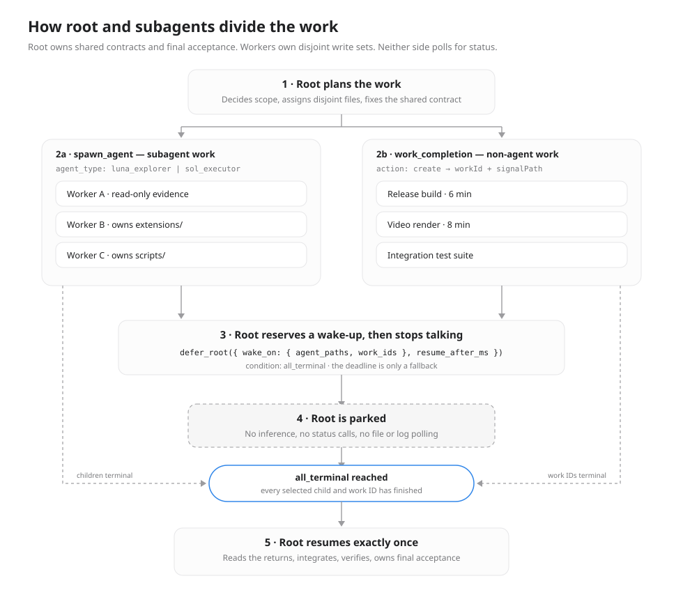
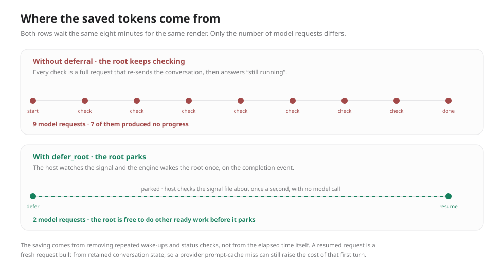
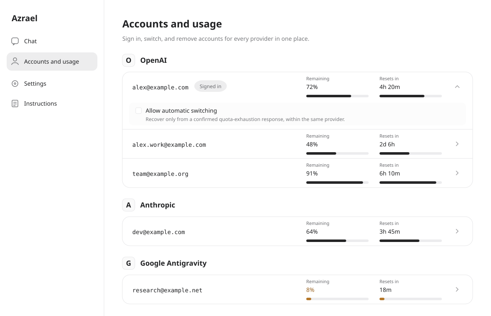
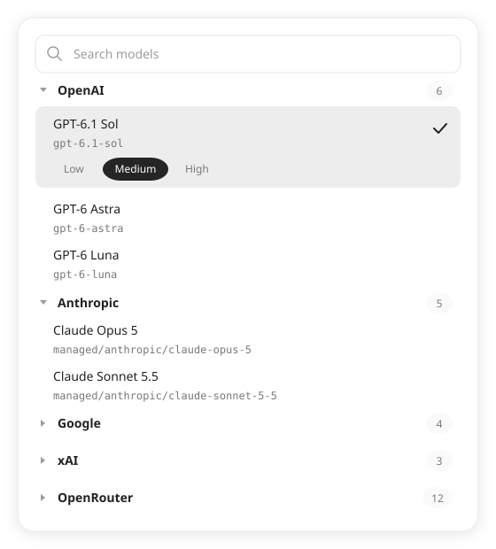
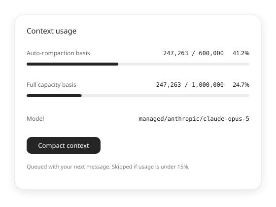
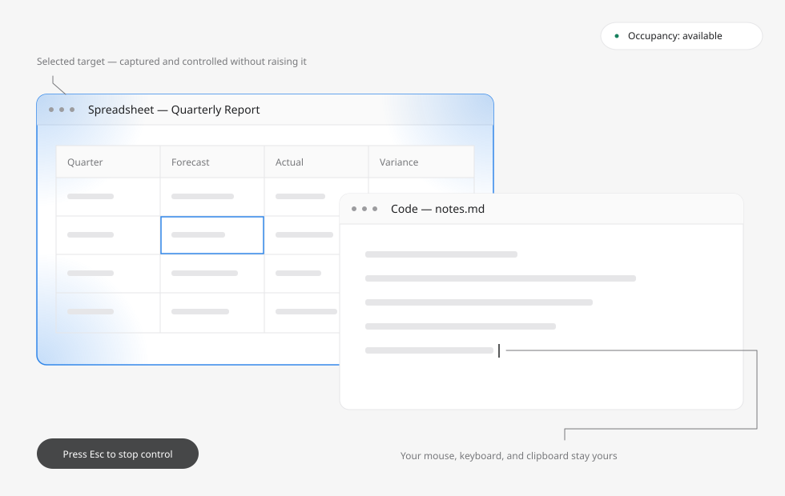
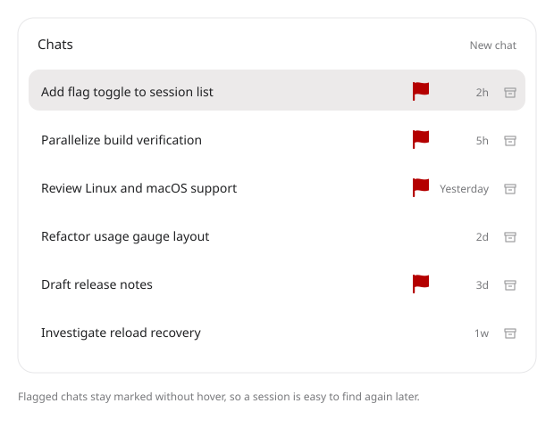

# Azrael

**[English](README.md) | [한국어](README.ko.md)**

Azrael은 AI 에이전트와 함께 코드와 프로젝트를 다루는 독립형 VS Code 호스트입니다. Codex 기반 엔진과 인터페이스에 여러 계정, 다양한 제공업체의 모델, 서브에이전트 협업, 컨텍스트 관리, 대화 복구 기능을 통합했습니다.

에이전트와 사람 모두를 위한 작업 흐름을 제공합니다. 독립적인 작업을 나누어 맡기고, 공통 결정은 하나의 루트 에이전트가 관리하며, 같은 인터페이스에서 계정과 모델을 전환하고 중요한 대화를 빠르게 다시 찾을 수 있습니다. Window Use는 사용자가 다른 곳에서 작업하는 동안 에이전트가 선택한 애플리케이션을 조작하는 방식을 탐구합니다.

Azrael은 하나의 통합 확장으로 실행됩니다. 계정, 대화, 설정은 일반 Codex 상태와 분리된 `~/.azrael-ex`에 저장됩니다. 설치 과정은 기존 Codex 확장과 다른 확장, VS Code 설정을 보존합니다.

## 주요 기능

| 기능 | 할 수 있는 일 |
| --- | --- |
| 채팅과 개발 도구 | VS Code 안의 대화에서 파일을 수정하고, 명령을 실행하고, 도구를 사용합니다. |
| 루트와 서브에이전트 협업 | 루트가 공통 결정, 통합, 최종 수용을 맡고 워커에게 범위가 정해진 작업을 배정합니다. |
| 루트 재개 예약 | 의존하는 작업을 기다리는 동안 루트를 대기시키고, 선택한 완료 신호나 대체 기한에 맞춰 재개합니다. |
| 여러 계정과 제공업체 | 계정을 연결하고, 확인 가능한 사용량을 비교하고, 계정을 전환하며 여러 제공업체의 모델을 선택합니다. |
| 컨텍스트 관리 | 제공업체별 자동 압축을 설정하고 턴 사이에 처리할 수동 압축 요청을 대기열에 넣습니다. |
| Window Use | 별도의 도구 인터페이스로 승인된 Windows 애플리케이션 하나를 찾고, 캡처하고, 조작합니다. |
| 대화 플래그 | 대화에 빨간 플래그를 표시해 Chats 목록에서 쉽게 찾습니다. |
| 복구와 대기열 | 대기 중인 입력을 유지하고, 이미 수락된 턴을 대조하며, 다시 로드한 뒤 대화를 복구합니다. |

아래 이미지는 **가상의 계정, 대화, 모델, 사용량 값으로 구성한 설명용 UI 재현 이미지**입니다. 비공개 세션 데이터는 포함하지 않으며, 그림에 나온 모든 상호작용이 설치된 릴리스에서 검증되었음을 뜻하지 않습니다. 구현과 수용 검증의 세부 내용은 연결된 기능 문서에서 확인할 수 있습니다.

## 소유권이 명확한 에이전트 협업

Azrael은 조율과 실행을 구분합니다. **루트 에이전트**는 범위, 공통 계약, 작업 순서, 자원 제약, 통합, 최종 수용을 결정합니다. **서브에이전트**에는 명확한 결과물, 담당 파일 또는 읽기 범위, 선행 조건, 권한 한계, 완료 기준을 전달합니다. 읽기 전용 조사와 구현에는 서로 다른 역할과 모델을 사용할 수 있습니다.

독립적인 작업은 병렬로 실행할 수 있습니다. 실제로 유효한 동시 실행 수준은 공유 파일, 빌드 잠금, CPU, 메모리, 기타 의존성에 따라 달라집니다. 루트는 워커가 실행하는 동안 유용한 독립 작업을 계속하고, 의존성이 생기는 지점에서 완료를 기다립니다. 완료 보고에는 실제 작업 범위, 종료 코드, 근거 경로, 남은 불확실성을 담아 반복 조사와 불필요한 상태 확인을 줄입니다.



### 서브에이전트 완료 또는 코드 완료 신호에 따라 재개

루트 재개 기능은 다음 두 종류의 작업을 선택해 기다릴 수 있습니다.

- **서브에이전트:** `defer_root.wake_on.agent_paths`로 기다릴 자식 작업을 지정합니다.
- **외부 코드 작업:** `azrael_agents.work_completion`으로 새로운 `workId`와 `signalPath`를 등록합니다. 빌드, 렌더링 등의 실행 주체가 등록된 신호를 통해 실제 최종 결과를 기록합니다. 예를 들어 [`scripts/complete-work.cjs`](scripts/complete-work.cjs)를 사용할 수 있습니다. `defer_root.wake_on.work_ids`로 해당 실행을 선택합니다.

`condition: all_terminal`을 사용하면 **선택한 자식 작업과 외부 실행이 모두 종료되었을 때** 루트가 기한보다 일찍 깨어납니다. 성공, 실패, 취소는 모두 종료 상태이며, 루트는 다음 단계로 진행하기 전에 결과를 확인해야 합니다. 예약 시각이나 지연 시간은 대체 기한을 제공합니다. 진행 상황 업데이트만으로는 루트가 깨어나지 않습니다. 호스트는 모델 요청 없이 약 1초 간격으로 외부 신호 파일을 확인합니다.

예를 들어 루트가 영상 렌더링을 시작하고 워커에게 함께 사용할 자료 준비를 맡긴 다음, 자신의 독립적인 수정을 마치고 대기할 수 있습니다. 선택한 두 작업이 모두 끝나면 재개하여 출력물을 확인하고 결과를 통합합니다. 기다리는 동안에도 렌더링은 계속 실행됩니다.

**Root resume reservations** 보기(`azrael.rootResume`)에는 대기 중인 예약, 사유, 현지 시간 기준 재개 시각, 사용 가능한 재개·취소 컨트롤이 표시됩니다. 예약을 취소해도 결과를 생성하는 작업은 계속 실행됩니다. 자동 재개가 실행되려면 루트가 로드된 상태로 엔진이 실행 중이어야 합니다. 영속적으로 저장된 예약은 다시 로드한 뒤 복구할 수 있습니다.

예약 대기 기능은 검증된 네이티브 도구 전송 경로에 제공되며, 현재는 **네이티브 OpenAI 루트 경로**가 해당합니다. 외부 작업 신호는 Windows 네이티브 소스에서 검증되었지만, 패키징, 설치된 호스트에서의 수용, 다른 플랫폼에서의 수용은 별도 검증 단계입니다. 다른 제공업체에서 일반적인 서브에이전트 협업을 사용할 수 있다는 사실이 이 예약 도구에 접근할 수 있음을 뜻하지는 않습니다.

### 더 빠르게 작업하고 토큰을 줄일 수 있는 이유

독립적인 작업을 순서대로 기다리지 않고 겹쳐 실행합니다. 명확한 소유권은 중복 수정, 경쟁하는 빌드, 다른 에이전트의 조사 내용을 다시 읽는 일을 줄입니다. 의존성이 생기는 지점에서 대기 중인 루트는 **추론을 계속 수행하지 않습니다**. 렌더링이나 빌드가 끝났는지 물으려고 모델을 반복해서 깨우는 요청을 줄입니다.



8분 예시는 요청 횟수를 설명하기 위한 것으로, 측정된 벤치마크나 토큰 감소량을 보장하는 수치가 아닙니다. 두 경우 모두 렌더링 시간은 같습니다. 불필요한 모델 요청과 상태 확인을 없애는 데서 절감 효과가 생깁니다. 재개할 때는 보존된 대화 상태를 바탕으로 새로운 요청을 보냅니다. 제공업체의 프롬프트 캐시 재사용은 별개이며, 캐시가 적중하지 않으면 입력 비용이 늘어날 수 있습니다.

[루트 조율](docs/architecture/root-coordination.md), [루트 재개 예약](docs/architecture/root-resume.md), 관리 중인 [지침 라이브러리](instructions/README.md)를 참고하세요.

## 사람을 위한 더 편리한 작업 흐름

### 계정과 사용량을 한곳에서 확인

프로필 메뉴의 **Accounts and usage**(`계정 및 사용량`)를 열어 계정을 연결·전환·삭제하고 제공업체별 사용량을 확인할 수 있습니다. 여러 계정을 저장해 두면 설정을 반복하지 않고 다음 작업에 적합한 계정을 선택할 수 있습니다. 확인 가능한 할당량과 초기화 주기는 제공업체마다 다르며, 관측할 수 없는 정보는 명시적으로 표시합니다.



계정과 사용량 컨트롤은 같은 페이지에 있습니다. 자격 증명은 Webview와 로그에 노출되지 않습니다. 계정을 전환해도 실행 중인 요청이 다른 계정으로 조용히 바뀌지 않으며, 관리형 스레드의 바인딩은 각 제공업체의 계약에 따라 제공업체·계정 식별 정보를 유지합니다.

[계정과 사용량](docs/architecture/accounts.md), [제공업체 계정 운영](docs/ops/provider-accounts.md)을 참고하세요.

### 여러 제공업체의 모델 선택

Azrael은 네이티브 OpenAI·Devin 경로와 관리형 제공업체 연동을 함께 제공합니다. 관리형 연동에는 Anthropic 구독 OAuth, Google Antigravity, Google AI Studio, xAI, OpenRouter가 포함됩니다. 사용자가 설정한 Chat Completions·Responses API 연결은 별도의 식별 정보와 모델 그룹을 가집니다. 실제 모델 가용성, 추론 설정, 인증 방식, 계정 한도는 연결에 따라 달라집니다.



모델 선택기에서 모델을 전환하고 지원되는 모델을 서브에이전트로 사용할 수 있습니다. 제공업체 전환은 턴 경계에서 이루어집니다. 이전 출력이나 압축 체크포인트를 다른 제공업체로 넘겨야 할 때는 크기가 제한된 인계 요약을 사용합니다. 인계 과정에서도 같은 엔진이 도구 실행, 권한, 대화 소유권을 유지합니다.

[관리형 제공업체](docs/architecture/managed-providers.md), [사용자 지정 API 모델](docs/architecture/custom-api-models.md), [Devin 연동](docs/architecture/devin.md)을 참고하세요.

### 작업 흐름을 이어 가며 컨텍스트 관리

제공업체별 자동 압축 설정은 선택한 모델의 용량과 컨텍스트 정책에 따라 적용됩니다. 진행 중인 작업을 중단하지 않고, 대기 중인 메시지와 함께 턴 사이에 처리할 수동 압축 요청을 대기열에 넣을 수도 있습니다. 서브에이전트는 상속한 설정에서 자신의 제공업체·모델 정책을 결정합니다.



압축은 크기가 제한된 요약을 이어지는 대화에 전달하며, 원래의 모든 세부 정보를 보존하지는 않습니다. 다시 로드한 뒤의 복구와 이미 수락된 입력의 대조는 수락된 메시지를 무작정 다시 보내지 않고 작업을 이어 가도록 돕습니다. 대기 작업 구간은 접을 수 있으며, 대기와 재개 상태는 계속 표시됩니다.

[컨텍스트 정책](docs/architecture/context-policy.md), [대기열의 압축 요청](docs/architecture/queued-compaction.md), [다시 로드한 뒤의 복구](docs/architecture/reload-recovery.md)를 참고하세요.

### Window Use: 선택한 애플리케이션을 중심으로 협업

전체 데스크톱을 다루는 Computer Use는 사용자가 사용하는 전경 애플리케이션, 커서, 키보드와 충돌할 수 있습니다. **Window Use**는 이러한 불편을 줄이기 위한 별도의 Windows 기능입니다. 에이전트가 승인된 창 하나를 찾아 선택하고, 그 대상을 관찰하며, 사용자가 다른 애플리케이션에서 작업하는 동안 지원되는 애플리케이션 컨트롤을 사용합니다.



데모 재현 이미지는 선택한 대상 하나, 별도의 사용자 작업 공간, 눈에 보이는 제어 상태로 구성된 협업 방식을 보여 줍니다. Windows Graphics Capture는 다른 창이 대상을 가리고 있어도 대상의 내용을 캡처할 수 있습니다. 구조화된 동작은 지원되는 경우 UI Automation을 재사용하며, 앱 승인, 점유 정보, 일시 정지·복구 컨트롤, 재사용 가능한 작업 매크로를 함께 제공합니다.

**Window Use는 실험적이며 일부만 검증되었습니다.** 실제 Firefox와 파일 탐색기 관찰, 일부 탐색기 동작은 확인되었습니다. 일반적인 동시 물리 입력 격리, 설치된 GUI·도구 수용, 승인 알림, 오버레이, 실제 창 매크로에는 아직 남은 수용 검증이 있습니다. 일부 동작은 대상 창을 활성화할 수 있으며, 백그라운드 키 전달은 실험적입니다. 가용성과 안정성은 애플리케이션이 사용할 수 있는 컨트롤을 제공하는지에 따라 달라집니다. 선택한 창에서 실패하더라도 권한이 전체 데스크톱으로 자동 확대되지는 않습니다.

Computer Use는 별도의 승인이 필요한 독립 기능으로 유지됩니다. Linux와 macOS 핵심 패키지에는 두 데스크톱 제어 백엔드가 모두 포함되지 않습니다.

[Window Use](docs/architecture/window-use.md), [Computer Use](docs/architecture/computer-use.md)를 참고하세요.

### 플래그로 대화를 다시 찾기

**Chats**의 대화 행에 있는 플래그 버튼으로 빨간 플래그를 추가하거나 제거할 수 있습니다. 플래그가 있는 대화에는 표시가 유지되며, 호스트와 대화 식별 정보에 따라 저장됩니다. 눈에 보이는 표시와 채팅 검색을 함께 사용해 중요한 작업으로 빠르게 돌아갈 수 있습니다.



## 플랫폼과 현재 제약

로컬 런타임의 대상은 **Windows x64, glibc Linux x64, Apple Silicon macOS**입니다. 플랫폼마다 배포와 수용 검증 상태가 다릅니다.

| 플랫폼 | 배포와 검증된 범위 | 사용할 수 없거나 수용된 범위 밖인 항목 |
| --- | --- | --- |
| Windows x64 | [2026.0.3](https://github.com/felrer/Azrael/releases/tag/azrael-v2026.0.3) 공개 배포. 기존 Windows 수용 검증이 기준입니다. | Window Use에는 앞서 설명한 실험적 제약이 남아 있습니다. |
| Linux x64 / glibc | [2026.0.1](https://github.com/felrer/Azrael/releases/tag/azrael-v2026.0.1) 공개 배포. WSLg를 통한 네이티브 Linux VS Code 환경의 Ubuntu 24.04 / glibc 2.39에서 수용되었습니다. | Computer Use, Window Use, Windows 데스크톱 제어 승인 알림은 사용할 수 없습니다. 독립 데스크톱, 이전 배포판, 실제 제공업체 인증·추론은 미검증 상태입니다. |
| macOS ARM64 | 내부 수용 검증을 일부 완료했으며 공개 배포는 보류 중입니다. | Computer Use, Window Use, Windows 데스크톱 제어 승인 알림은 사용할 수 없습니다. 공개 설치, 서명, 공증은 릴리스 범위 밖입니다. |

공개된 Linux 패키지에는 **glibc 2.39 이상과 OpenSSL 3**가 필요합니다. 관리형 계정 저장에는 데스크톱 Secret Service가 필요하며, 한국어 레이블에는 CJK 글꼴이 필요합니다. Intel Mac, Linux ARM64, Alpine/musl, 일반적인 WSL 제품 지원, 원격 확장 호스트, 컨테이너는 별도의 후속 대상입니다. WSLg 수용 검증이 이러한 추가 대상까지 입증하지는 않습니다.

공유 채팅, 제공업체 관리, 개발 도구, 협업, 대기열, 복구에는 공통 제품 계약이 적용됩니다. 소스 테스트, 네이티브 실행, 설치된 호스트의 UI 확인, 실제 제공업체 추론은 서로 다른 근거입니다. 특정 대상을 지원한다는 사실이 그 환경의 모든 기능을 입증하지는 않습니다. 전체 upstream `codex-core`와 워크스페이스 회귀 수용 검증은 확립되지 않았습니다.

[다중 플랫폼 계약](docs/architecture/multi-platform.md), [플랫폼 운영](docs/ops/multi-platform.md), [현재 개발 상태](docs/ops/development.md#current-state)를 참고하세요.

## 설치

### Windows: 공개 패키지 설치

1. VS Code와 PowerShell 7을 설치하고 VS Code의 `code` 명령을 사용할 수 있도록 설정합니다.
2. [Windows 릴리스](https://github.com/felrer/Azrael/releases/tag/azrael-v2026.0.3)에서 `Azrael-2026.0.3-windows-x64.zip`과 `SHA256SUMS.txt`를 내려받습니다. 체크섬 파일과 압축 파일의 SHA-256을 비교한 뒤 새 디렉터리에 압축을 풉니다.
3. PowerShell 7에서 압축을 푼 패키지 디렉터리를 열고 다음 명령을 실행합니다.

   ```powershell
   ./install.ps1
   ```

4. VS Code에서 **Developer: Reload Window**를 실행해 설치된 호스트를 활성화합니다.

패키지에는 검증된 런타임 의존성과 번들 Node가 포함됩니다. 설치 프로그램은 파일 목록을 검사하고, 버전별 런타임 설치를 생성하며, 통합 VSIX를 준비합니다. 기존 인증과 대화를 보존하고, 활성 창을 자동으로 닫거나 다시 로드하지 않습니다.

기본 런타임 릴리스는 `%LOCALAPPDATA%/azrael-ex/releases`에, 상태는 `%USERPROFILE%/.azrael-ex`에 저장됩니다. `-ReleasesRoot`, `-StateRoot`, `-CodePath`로 경로를 변경할 수 있습니다. `-PrepareOnly`는 VS Code를 호출하지 않고 설치를 준비합니다. 상태 경로를 바꿔도 기존 계정이나 대화가 이전되지는 않습니다. 옵션과 복구 방법은 [앱 릴리스 설치](docs/ops/app-release.md#package-and-installation-contract)를 따르세요.

### Linux: 플랫폼 패키지 지침 사용

[Linux 릴리스](https://github.com/felrer/Azrael/releases/tag/azrael-v2026.0.1)에서 Linux 파일 네 개를 모두 내려받습니다. `.tar.gz` 압축 파일, `.manifest.json`, `.SHA256SUMS.txt`, **`Azrael-2026.0.1-linux-x64.INSTALL.md`**를 같은 디렉터리에 보관하세요. 앞서 설명한 의존성을 갖춘 뒤 패키지를 검증하고 압축을 풉니다.

```sh
sha256sum -c Azrael-2026.0.1-linux-x64.SHA256SUMS.txt
mkdir Azrael-2026.0.1-linux-x64
tar -xzf Azrael-2026.0.1-linux-x64.tar.gz -C Azrael-2026.0.1-linux-x64
cd Azrael-2026.0.1-linux-x64
```

새 런타임을 선택하기 전에 기존 Azrael 세션을 닫고, 번들 Node를 사용하는 설치 프로그램을 실행합니다.

```sh
./runtime/runtime/node/node install-platform-release.cjs \
  --package "$PWD" \
  --install-root "$HOME/.local/share/azrael/releases" \
  --state-root "$HOME/.azrael-ex" \
  --code /usr/bin/code
```

`/usr/bin/code`를 로컬 VS Code CLI의 절대 경로로 바꾸고, 설치 후 VS Code를 다시 시작하세요. 새 런타임 디렉터리와 별도의 Azrael 상태 디렉터리를 사용합니다. Secret Service 설정, 준비만 수행하는 설치, 복구에 관한 세부 내용은 내려받은 `INSTALL.md`를 따르세요.

macOS에는 아직 공개 설치 패키지가 없습니다. 내부 후보 빌드를 준비하는 개발자는 [플랫폼 운영](docs/ops/multi-platform.md)을 따르고, 부분 수용 상태를 유지해야 합니다.

## 처음 사용하기

1. VS Code를 다시 로드한 뒤 Azrael 사이드바를 엽니다.
2. 프로필 메뉴의 **Accounts and usage**(`계정 및 사용량`)에서 계정을 연결합니다.
3. 사용할 수 있는 모델을 선택하고 작업을 요청합니다. 원하는 결과와 관련 제약을 설명하세요. 활성화된 환경에서는 독립적인 작업을 서브에이전트에게 맡길 수 있습니다.
4. **Azrael settings**에서 컨텍스트 정책, 지침 구성 요소, 해당되는 데스크톱 제어 설정을 조정합니다.
5. 중요한 Chats 행에 플래그를 표시합니다. 루트 재개가 예약되어 있다면 예약을 확인하고 필요에 따라 사용 가능한 재개·취소 컨트롤을 이용합니다.

Windows의 Window Use는 기능을 활성화하고 대상 애플리케이션을 승인한 뒤 창을 선택하세요. 데스크톱 동시 작업에 의존하기 전에 실험적 제약을 읽어 두세요. 제공업체별 연결 요건은 [제공업체 계정 운영](docs/ops/provider-accounts.md)에, Devin 설정은 [Devin 운영](docs/ops/devin-native.md)에 설명되어 있습니다.

## 개발

### 프로젝트 구조

| 경로 | 책임 |
| --- | --- |
| [`engine/`](engine/) | Codex 기반 Azrael 엔진과 소스 출처 정보. |
| [`extensions/azrael-ex/`](extensions/azrael-ex/) | 통합 호스트에 내장된 계정, 사용량, 설정 모듈. |
| [`providers/`](providers/) | 제공업체 인증과 추론 연동. |
| [`native/`](native/) | Windows 네이티브 기능. |
| [`plugins/`](plugins/) | 플러그인과 관련 스킬·도구. |
| [`instructions/`](instructions/) | 관리 중인 조율 지침, 역할, 스킬, 예제. |
| [`scripts/`](scripts/) | 빌드, 패키징, 검증, 설치, 릴리스 도구. |
| [`docs/`](docs/) | 아키텍처, 코드 맵, 운영, 프로젝트 Playbook. |
| `artifacts/` | Git에서 제외하는 빌드 출력, 변경 불가능한 릴리스 입력, 패키지, 로그. |

### 소스에서 빌드하고 검증하기

저장소를 복제하는 것만으로 모든 빌드 입력이 갖춰지지는 않습니다. Windows 개발에는 PowerShell 7, Git, Node/npm, Python 3.11 이상, 고정된 Rust 도구 체인과 MSVC Build Tools, VS Code, 고정된 공식 UI 스냅샷, 호환되는 code-mode 호스트, 서로 맞는 공식 확장·오디오 입력이 필요합니다. Devin에는 지정된 Node 런타임이 필요하고, 관리형 연동에는 고정된 Bun 런타임을 사용합니다. 정확한 요건과 출처 관리 규칙은 [개발 운영](docs/ops/development.md#prerequisites)에 있습니다.

프로젝트 루트에서 자리표시자를 실제 절대 경로와 새로운 릴리스 이름으로 바꿔 실행합니다.

```powershell
./scripts/deploy-azrael.ps1 -ReleaseName '<new-release-name>' `
  -SourceRoot "$PWD/engine" `
  -EngineTargetDirectory '<absolute-rust-cache-path>' `
  -CodeModeHostPath '<absolute-compatible-code-mode-host.exe>' `
  -OriginalExtensionPath '<official-extension-path>' `
  -OriginalAudioPath '<matching-official-audio-extension-path>' `
  -VerifyOnly
```

`-VerifyOnly`는 빌드, 패키지 준비, 격리된 호스트 검증을 수행합니다. 사용자 프로필에 설치하려면 새로운 릴리스 이름을 사용하고 `-VerifyOnly`를 제외해 별도로 실행합니다. 전체 배포에는 이미 빌드가 포함되므로 전체 빌드를 따로 실행할 필요는 없습니다. 계정 모듈의 `azrael-ex.vsix`는 중간 패키지이며, 설치 대상은 검증된 통합 호스트입니다.

기여하기 전에 [AGENTS.md](AGENTS.md)를 읽고 해당하는 [프로젝트 Playbook](docs/playbooks/README.md)을 선택하세요. 입력을 고정하고, 소스 출처를 보존하고, 실제 변경 범위를 검증하며, 활성 런타임과 롤백 런타임 경로를 보존해야 합니다. Linux/macOS 후보 빌드는 [플랫폼 운영](docs/ops/multi-platform.md)을 따르세요. 소스 변경, 패키징, 설치된 호스트의 수용, 공개 릴리스 인증은 각각 별도 단계입니다.

### 문서

- [문서 안내](docs/README.md): 문서 경로, 소유권, 상태 표기 규칙.
- [아키텍처](docs/architecture/README.md): 기능 동작과 시스템 계약.
- [코드 맵](docs/maps/README.md): 구현 소유자와 진입점.
- [운영](docs/ops/README.md): 개발, 설치, 계정, 진단.
- [프로젝트 Playbook](docs/playbooks/README.md): 검증, 정리, 작업 요건.
- [지침 라이브러리](instructions/README.md): 재배포 가능한 역할, 스킬, 조율 지침.

## 라이선스와 출처

Azrael 자체 코드와 지침에는 [MIT 라이선스](LICENSE)가 적용됩니다. 가져온 구성 요소에는 각자의 라이선스와 조건이 유지됩니다. Codex 기반 엔진은 [Apache-2.0 라이선스](engine/LICENSE)와 [NOTICE](engine/NOTICE)를 유지하며, 소스 식별 정보는 [`engine/SOURCE.json`](engine/SOURCE.json)에 있습니다. 제공업체 연동, 런타임, 글꼴, 공식 UI 재배포 조건은 [제3자 고지](THIRD_PARTY_NOTICES.md)에서 다룹니다.
