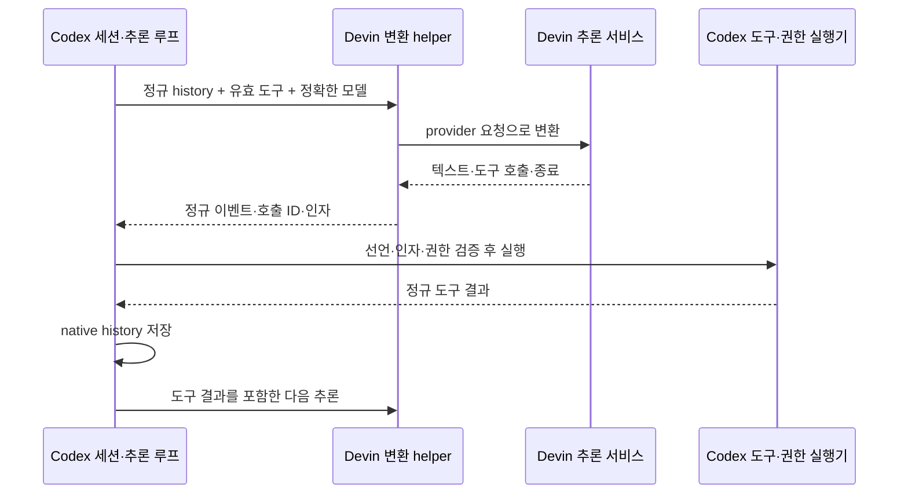

# azrael-ex

Status: AZ-01 UI migration in verification, 2026-09-28. The 26.917.62051 official UI assets have been prepared and namespaced for the independent host, and the 0.157.1 Azrael engine remains the sole app-server. Packaged-host and live provider acceptance remain separate from source transformation checks; see [development acceptance](../ops/development.md).

The approved replacement target is [Azrael runtime and providers](azrael-runtime.md). The pinned-host and API-key paths below describe the existing implementation and its verified limits until their corresponding replacement is implemented and tested.

## Product and boundaries

Single-extension implementation, approved and verified in isolated acceptance 2026-09-13 (live user-state concurrency excluded): `azrael-ex-local.azrael` owns chat, account management and usage in one installed extension. Ordinary `openai.chatgpt` remains intact and may coexist, but is not an activation dependency. The separate `azrael-ex-local.azrael-ex` installation is retired. Its existing UI, refresh coordination and bridge service become an internal module of the host; native authentication, protocol and storage contracts below remain unchanged.

The host entry point activates the pinned Codex-style UI host first, then initializes the embedded account UI with the exact host-local runtime and extension context. Embedded account activation does not register the temporary `azrael.chat` Webview or its sidebar command. The wrapper preserves the host activation result and disposes both modules on shutdown. No module activates or discovers another extension to establish the engine connection. Commands and panels use `azrael.*`; the profile menu has one **계정 및 사용량** entry dispatching `azrael.usage`. Account and usage pages must open without an installed companion. An invalid local runtime produces an explicit unavailable error rather than silently ignoring a menu action.

The build embeds the compiled account module and production dependencies in the same host VSIX. `azrael-ex.vsix` remains a hash-verified internal packaging input, not an independently installed product. Only a marked integrated host can replace the prior two-extension installation. Install the tested host, then remove the old companion through VS Code after backing up azrael-owned installation records. Preserve `~/.azrael-ex` accounts/sessions, engine/bridge provenance, original Codex files/registry, unrelated extensions and editor settings. Retain the prior deployment for recovery and never terminate active windows. Acceptance requires native and account activation, the unified account/usage menu route, the same engine runtime, no companion in the installed inventory and original Codex preservation. Installation is not evidence of model-response or live account concurrency behavior.

Use the existing stable sidebar/Webview/custom-editor fallback. The local ID is not entitled to the original extension's proposed VS Code APIs, so omit `chatSessionsProvider`/`languageModelProxy` declarations and the corresponding contributed chat-session entry. The pinned host already catches unavailable proposals and retains normal chat panels; never alter VS Code's global API allowlist, startup flags or product files. Native engine chat history, models and account management remain available. The Windows host IPC pipe is `azrael-ipc`, separate from original `codex-ipc`; preserve randomized temporary paths and native app-server provider keys. The clone's rules language has its own ID without claiming ordinary `.rules` file associations.

azrael derives its chat UI from a local pinned copy of the official extension and combines it with the integrated account module and its independently built engine. The installed original is not modified or required for runtime activation. Native authentication identifiers and upstream network endpoints are preserved. The current UI source is official extension `26.917.62051`; the current engine source is `rust-v0.157.1` at commit `36650394c5b38c2990ccf2a3457165ca3e9d9726`. UI source hashes, transform-rule hashes, engine source fingerprint and binary hash are recorded with the prepared host. The earlier `26.908.40401` UI and `rust-v0.154.0-alpha.6.2` engine described by older validation records are historical inputs, not this candidate's runtime.

The integrated account module must control the same engine instance used by the azrael chat UI. Preserve its stdio protocol and reuse native auth, config, account events and local transport where possible. Management IPC must authenticate and identify the instance and restrict local access to the current user. A second engine controlling only its own account does not satisfy this design.

The existing local transport uses WebSocket frames over AF_UNIX, including on Windows. Its private-directory checks and Rust client's current-user, non-elevated peer checks are the preferred reuse boundary. The initial connection experiment will add an explicitly enabled socket alongside stdio and use a small Rust client bridge for Node interoperability. This is a companion connection, not a proxy replacing the official stdio channel. Per-instance rendezvous and bridge method restrictions must be verified before account management is enabled.

## Local image links in chat

Target: Azrael's pinned host file-link provider keeps its existing absolute, cwd-relative, and workspace-relative path resolution. For local image paths with the extensions supported by the installed VS Code media preview (`jpg`, `jpe`, `jpeg`, `png`, `bmp`, `gif`, `ico`, `webp`, `avif`, `svg`), it opens the resolved URI with VS Code's built-in `imagePreview.previewEditor`. Other files retain the text-document route and line/column selection; the file-manager action still reveals the file in the OS. The Azrael-only transformation is guarded by a unique pinned source anchor and included in package provenance. The original Codex extension is not modified. Packaged and live acceptance are recorded separately in [development](../ops/development.md).

## Local files dragged into chat

Target: dragging saved local files from a VS Code editor tab, VS Code Explorer, or Windows File Explorer into the Azrael composer adds removable file-reference chips without sending the turn. Editor and Explorer URI payloads are accepted only for local `file:` paths. The extension's existing file-metadata request confirms each path is a file before the existing picked-file attachment flow adds it. The native turn receives the file path and label through the existing context contract; it does not snapshot unsaved editor changes. Image files continue through the existing image attachment path. Duplicate paths are collapsed, while remote schemes, directories, inaccessible files, and ordinary dragged links do not become file references. The pinned Webview transforms are Azrael-only and included in package provenance. Source-level validation has passed; packaged and installed behavior remain separate acceptance steps.

## External image URL safety transport

Partial, 2026-09-16: runtime helper and pinned injection implemented; offline
contract tests, staged-asset checks and direct live-helper requests passed. Installed-host acceptance
is pending. Restore delivery to the existing URL safety service without
relaxing image policy. The host retains ownership of authentication and uses Node's
standard HTTPS client only for POST to the exact
`https://chatgpt.com/backend-api/ecosystem/url_safe` endpoint. Other requests retain
the upstream fetch transport. No browser session, cookie import, challenge solver,
domain exemption or direct-image fallback is introduced. Configured proxy routes
retain the upstream transport rather than silently using a direct connection.

The request keeps the existing host-built authentication headers, uses normal TLS
verification, refuses redirects and bounds duration and response size. The UI's
existing `safe === true` gate remains authoritative: `safe: false`, transport
failure, invalid responses and unavailable checks never authorize rendering.
Diagnostics include transport, status and challenge indication, never credentials,
cookies, response bodies or the image URL. This transport change does not establish
image safety or guarantee acceptance by Cloudflare on every network.

## Storage and settings

Historical separate-window installation target, superseded by same-window installation: share only the VS Code executable with ordinary VS Code. The default installer prepares an immutable extension generation below `%LOCALAPPDATA%/azrael-ex/vscode/installations`, uses a persistent private `user-data` directory, and selects it through the azrael desktop shortcut. Every launch passes both private editor and extension paths. The existing native `~/.azrael-ex` account/session home remains unchanged; ordinary `.codex`, editor settings and extensions are separate. Reuse the existing pinned host preparation and private per-host runtime, so reloading a window produces a fresh management socket without inherited global environment changes. Original Codex and azrael may run concurrently in separate windows. Internal extension IDs remain unchanged inside separate extension directories.

This supersedes ordinary deployment below. New installs must never patch ordinary Codex. Migration first verifies the isolated installation, then restores only known azrael-modified ordinary extension files from the retained pristine backup, removes azrael-only patch files and the ordinary companion, and reverses azrael update pinning. Back up the current files and registry before restoration, refuse unknown changes, and leave running windows untouched; ordinary windows need a reload after their current work ends. Retain original and migration backups for recovery. Keep the old per-instance launcher for verification fixtures; it is not the default user entry point.

A persistent editor profile can still be owned by the old VS Code process after an update. Refuse forwarding a new generation to that process and ask the user to finish work and close azrael windows before reopening. This does not require closing ordinary VS Code. Never silently report a new engine as running merely because a new extension directory was selected on disk.

The host runtime registry keys the physical runtime file with case-insensitive normalization on Windows. Node's module cache alone is insufficient: VS Code may load the same path with different drive-letter casing, otherwise creating different sockets for the engine and companion. Both loads must receive the identical runtime and process proxy within one extension host; different extension hosts remain isolated.

Engine freshness contract, approved 2026-09-13: each deployable engine bundle carries a source provenance receipt containing the upstream checkout HEAD, a digest of tracked and nonignored untracked file contents (including deletions), fixed target, relevant Rust build environment and hashes for the source-built engine and management bridge. The compatible code-mode host imported from the installed Codex runtime is separately identified by original absolute path and SHA-256, then copied beside the engine and covered by the bundle hash. This distinction is required because the upstream Windows `rusty_v8` asset is not currently available for a local host rebuild. Full builds compare source snapshots before and after compilation; packaging and installation verify the receipt against current sources and all three binaries. Missing provenance or any mismatch requires rebuilding. A newly generated package timestamp cannot establish that its reused engine contains current work from other sessions.

Historical ordinary VS Code deployment, superseded by independent installation: install the locally patched pinned official extension and companion into the user's existing default VS Code profile. Keep editor settings, unrelated extensions and projects intact. The installed host initializes the existing `~/.azrael-ex` execution home, matched release engine/bridge and a unique per-extension-host management socket without requiring a special launcher or changing user/system environment variables. Both extensions load the same cached runtime module regardless of activation order; the companion connects only after official activation. Local artifacts include the original extension backup, companion VSIX and deployment receipt; ordinary `.codex` state is never imported. Unknown official versions or patches fail before installation. The isolated launcher remains for verification and explicit isolated deployment. Direct file deployment and companion installation completed 2026-09-13 after 29 tests and a staged build passed. The user requested installation before the ordinary host fixture completed; live UI acceptance remains unverified.

Internal account-module builds use a fresh source staging directory under `artifacts/build/`, with lockfile installation there. This separates package generation from native modules already loaded by running extensions or verification hosts. A rebuild does not remove dependencies from a running host's source tree.

Build workflow implemented, 2026-09-13, with package-reuse and isolated preparation validation: project-local `artifacts/` owns generated VSIX packages, versioned deployable releases, build logs and validation fixtures, and is excluded from Git. The existing ignored Rust `target/` remains the incremental build cache. Each release contains one engine/bridge pair and an internal account-module package; running release binaries are never overwritten by a rebuild. Account/session state remains in the existing execution home outside disposable build artifacts. The launcher can reinstall a selected release, and a previous release remains available for rollback. The per-instance isolated launcher remains available for verification; the persistent independent installer is the user entry point. A fresh full build through the new wrapper was not part of this path-only change's validation.

The instance uses an absolute `CODEX_HOME`, defaulting to `~/.azrael-ex` on the engine OS. Native session paths, JSONL, SQLite schemas and migrations remain unchanged. The root stays fixed across account switches. Config, logs, caches and user skills resolve there too; project config and managed policy retain native precedence. No Codex authentication, account, session, history, rollout, database, log, lock, socket or pipe state is imported.

Installation takes a one-way snapshot of an allowlisted part of the ordinary Codex environment; explicit preparation validates that snapshot without applying it. The snapshot owns the global `AGENTS.md`, configured standalone agent roles, approved `[agents]` defaults, personal skills, plugin/app enablement, follow-up queue mode, and the path-dependent marketplace, notification, MCP and shell-environment settings needed by those capabilities. It is neither live nor bidirectional. Azrael's pre-existing root model, reasoning effort, model catalog, sandbox/project policy and all provider-owned credentials remain authoritative. A source change is observed only on the next explicit preparation or application.

Snapshot preparation parses complete TOML values using Python's standard parser, merges selected values, rewrites managed home references, validates runtime files and hashes, and materializes enabled plugins from their Azrael-local marketplace snapshot instead of copying the ordinary plugin cache. Serialization normalizes TOML formatting/comments while preserving unselected values. Drive skills are verified against the configured account, then linked to their existing targets. Missing skill frontmatter is reported as a source warning, not counted as verified native availability. The complete managed file/directory/link state participates in idempotency checks. Concurrent source/destination edits detected during staging reject the commit; a commit lock serializes snapshot writers. Handled commit errors restore backed-up targets. Process termination or power loss requires reviewing the retained `recovery.json`/previous files and stale lock; the multi-file operation is not crash-atomic. OAuth-backed MCP/apps copy only their declarations and enabled state; they remain disconnected until separately authenticated in Azrael. A missing runtime, marketplace, Drive skill target, malformed role/config, or failed plugin materialization aborts preparation without replacing the current managed environment. Environment application and VSIX installation have separate receipts: a later extension installation failure does not implicitly undo an already applied environment snapshot.

`devin_swe2_medium` is a selectable standalone agent role pinned to `devin/swe-2-medium`; it does not replace the default child model. The exact provider variant already represents Medium, so the role does not add a Codex reasoning-effort override. Its effective developer instructions are generated from the current `sol_executor` source and must be byte-identical on every preparation. Its provider-qualified key must resolve through the Azrael-owned Devin catalog and CLI authentication. Missing enablement, login or exact catalog membership fails that spawn explicitly; there is no OpenAI/Sol fallback.

Shared environment sync, script and host integration implemented and locally verified 2026-09-17; packaged-host acceptance pending: a dedicated git repository owns the shareable part of the Azrael execution home — the global `AGENTS.md`, standalone agent roles, personal skills and the `[agents]` config keys — plus a playbook library. The repository's `azrael-environment.json` manifest selects which bundle contents apply: `environment/` is the bundle applied as a unit, `library/` holds managed-but-unapplied skills, and `playbooks/` is fetched selectively into a workspace's `docs/playbooks/`. The repository replaces the Obsidian Vault as the management location for shared skills and playbooks; Vault copies are no longer authoritative.

The host exposes `azrael.sharedEnvironment.repository` and `azrael.sharedEnvironment.ref` settings plus the `azrael.syncSharedEnvironment` and `azrael.fetchSharedPlaybook` commands. Sync is manual only; activation never fetches. The command runs the packaged `account-ui/sync-shared-environment.cjs` with the host's Node runtime and the pinned engine for staged config validation. The tool maintains a managed git checkout at `CODEX_HOME/azrael/shared-environment`, refuses a dirty checkout or a mismatched origin, fetches the configured ref, then applies the bundle through the same staged-commit pattern as the Codex environment snapshot: managed-target containment, concurrent-change detection, a commit lock, a timestamped backup with `recovery.json`, and a fingerprint receipt at `azrael/shared-environment/snapshot.json`. Identical fingerprints short-circuit to `unchanged`; `--mode validate` stages and checks without applying.

Ownership is disjoint from the Codex environment snapshot: `azrael-codex-environment.json` sets `copyGlobalInstructions` to false and no longer lists agent roles or personal skills, so the one-way `~/.codex` snapshot retains only machine-bound settings (marketplaces, plugins, MCP, notify, features, shell policy, desktop). The shared bundle owns instructions, roles, skills and `[agents]` keys. Applied changes take effect on new threads; running windows and threads are not restarted. `devin_swe2_high` remains a generated role derived from the synced `sol_executor` instructions.

The integrated host wraps the pinned native implementation with a private process environment overlay and overrides the native engine resolver. Its entry point passes the same runtime to account management. It does not change user/system environment variables or editor settings. Ordinary Codex retains `chatgpt.*` preferences; azrael owns `azrael.*`.

Session-list scoping, implemented and packaged acceptance passed 2026-09-15; live user-state visual acceptance remains pending after window reload: the recent-chat list shown in the Azrael sidebar supplies the native server-side `cwd` filter for the file-system roots of the current VS Code workspace. A multi-root workspace supplies every eligible root and therefore returns their union. A window without an eligible file-system workspace supplies an empty filter and shows no recent sessions rather than falling back to all Azrael history. Filtering happens before pagination results are returned; the UI does not fetch an unscoped page and discard foreign sessions afterward. This first phase uses the existing exact-cwd contract, does not create or migrate app-server projects, and does not use the experimental `projectId` filter. Other list consumers and directly opening a known thread remain outside this visible recent-list boundary.

The pinned Webview identifies only its `recent_threads` request for workspace scoping. The extension host owns access to VS Code workspace folders, removes that internal identification before forwarding the request, and supplies `cwd` at the common app-server request boundary. This preserves the Webview sandbox and leaves archive checks, collaboration hydration, and other unmarked `thread/list` requests unchanged. Preparation fails closed if either the pinned recent-list call shape or the host request boundary changes. Focused acceptance exercised the combined dynamic request path, single-root, multi-root, empty/non-file roots, marker removal, unrelated list requests, and pinned packaged assets; fresh-state standalone and same-window host acceptance also passed all stages. The previous literal-call-only transformation did not cover the visible recent-chat path and is not acceptance evidence for this contract.

Provider inclusion correction (implemented and focused request-transformation checks passed, 2026-09-17; not yet packaged or installed): the same marked recent-chat request supplies `modelProviders: []` so persisted conversations from every provider remain eligible after reload. The native server treats an omitted or null provider filter as the configured default provider, whereas an empty array means no provider restriction. Workspace, archive, source and pagination filters remain in effect. This change does not rewrite stored sessions or change unmarked list consumers. Verification covered foreground/background requests, omitted/null/explicit provider inputs, retained pagination/archive/workspace filters, unrelated consumers and pinned original host/Webview transformation guards. Installed-window acceptance remains pending.

Reuse the official General, Configuration, Personalization, Usage/Billing, MCP, Hook, Plugin and Account settings. The integrated account module adds account management and entry points. A category counts as verified only after reading, saving, rereading and observing its effect; settings requiring reload or a new thread must say so. Billing actions link to official pages. Keyboard shortcuts use VS Code's standard surface.

The independent host's private process environment canonicalizes Windows
`Path`/`PATH` to one `PATH` key before the pinned bundle appends its tool directory.
Copying `process.env` into a plain object must preserve the inherited search path
without changing the shared extension-host environment.

## Accounts and switching

Current, 2026-09-16 (generated-host namespace checks and evaluated packaged click handlers passed; installation and visual interaction unverified): the sidebar profile dropdown includes one **계정 및 사용량** entry above the native settings entry. It opens the unified host-owned Webview through `azrael.usage`. The command palette exposes the same page once; `azrael.manageAccounts` and `azrael.devinAccount` remain callable aliases but are hidden from the palette. The local pinned UI patch supplies the entry points; the integrated account module and native engine own authentication, switching and usage. Existing settings, shortcuts and logout retain their behavior.

Profiles distinguish the login identity and workspace account; email alone is not identity. Store only IDs and display metadata outside the native secure credential store. Tokens never enter Webviews or logs. One owner serializes profile refreshes, including across processes sharing credentials.

Multi-window correction (2026-09-13, implemented; unit, native concurrency and packaged empty-state host acceptance passed): each window may independently select any account, including an account selected in another window. Root and managed-profile usage take shared OS leases; credential refresh takes a separate cross-process transaction lock with a 30-second admission deadline and reloads persisted tokens before contacting the authority. Identity-changing native login, capture, logout and removal require exclusive usage admission so they cannot invalidate another window's active credentials. Same-identity reauthentication is serialized with refresh. If an older engine retains an exclusive lease, a new engine starts without borrowing its root credentials and still exposes account selection; it does not terminate or remove the older engine's lock. Runtime selection remains engine-local. Original Codex keeps its existing behavior and storage.

Selected-account state uses two host-private paths. `AZRAEL_EX_ACCOUNT_STATE_FILE` remains under workspace storage and a hash of the opaque VS Code session ID, with the equivalent session scope under global storage for empty windows; this preserves independent selections in simultaneously open windows. `AZRAEL_EX_ACCOUNT_DEFAULT_FILE` is stable for the workspace, or stable in global storage for empty windows, and records the last successfully committed selection as the default for a new editor session. A session file takes precedence whenever it exists, including an explicit empty selection. Otherwise startup restores the durable default. A completed switch or explicit selection clear attempts an atomic replacement of each file and reports a save failure if either replacement fails; pending, cancelled and failed switches do not change either. The wrapper does not change `process.env`.

For the first release of durable defaults, the host initializes a missing default from the most recently modified valid legacy session selection in the same storage scope. Migration accepts only the existing sanitized selected-profile JSON contract and never reads credentials. Once installed-state acceptance confirms that supported profiles have created durable defaults, remove the legacy session-directory scan; the engine's former common `CODEX_HOME/azrael/account-state.json` remains only the existing fallback for runtimes that do not supply either host-private path.

Profile authentication homes live under `CODEX_HOME/azrael/accounts`, separate from the fixed execution home. Each profile reuses a native AuthManager with strict keyring storage and the platform's native backend; there is no plaintext fallback. Each profile manager holds a shared OS usage lease. The active manager is retained for execution; an inactive usage query releases its lease afterward. Concurrent instances serialize refresh and reuse persisted credentials; destructive operations report a busy profile while another manager uses it. Profile managers use the root manager's application network policy for outbound requests, but loading a profile's stored identity does not invalidate that shared policy; root account changes remain responsible for invalidation and policy reload. The engine's native external-auth provider seam resolves the selected managed ChatGPT authentication without changing the native account type or rollout root.

Additional login uses the native OAuth server in a staged authentication home. Reauthentication replaces a profile only after both user and workspace identity match. Account capture is an explicit companion action for the existing azrael login, never an import from ordinary Codex storage. Profile removal deletes local credentials without revoking unrelated sessions. Companion RPC uses the `azrael/account` method and `azrael/account/updated` notification; only sanitized state and the temporary native login URL cross this boundary.

Account-management recovery: the initial connection waits through bounded transport retries before reporting terminal unavailability. Recovered startup failures do not leave a permanent disabled notification. Home, version and engine-identity mismatches fail closed; reconnection never replays account mutations. Disposal cancels scheduled recovery. A profile removal rejected by a held lease reports that the profile is in use and directs the user to finish account operations and switch away or close its owning azrael window. Missing storage and denied access are reported only for their confirmed I/O error kinds; unclassified failures do not invent an authentication or lease cause. Never bypass a lease or delete its lock file to force removal.

Switching is manual and scoped to the connected engine. Active or approval-waiting turns defer a switch without cancellation of work. Pending switches are visible and cancelable. Atomically block new turn admission and verify idle, validate target authentication, refresh account-dependent native state, verify actual identity, then emit native account events and resume admission. Failed switches retain or restore the previous identity; uncertain recovery blocks new work. Account changes must propagate to official host/cloud authentication as well as local model requests.

Execution leases follow actual core task lifetimes, including completion and child handoff, rather than delayed UI status events. A pending switch rejects new external work but lets existing tasks finish their child work. The switch tries the exclusive lease without queueing a writer, avoiding a parent/child deadlock. Realtime conversations and detached memory inference also retain execution leases. Account-state snapshots carry an instance-local revision so delayed responses cannot revert newer UI state. When a window has no managed-profile selection, the snapshot still identifies a saved profile as active when both its workspace account and user IDs exactly match the engine's current authentication; the UI therefore shows the actual current account on first open without relying on email matching. Authentication cache reload and refresh discard results from a provider that has been replaced while the request was in flight.

Startup notices: the azrael-only pinned extension host supplies the existing first-run tutorial completion flags and the image-generation announcement dismissal flag on state reads. This applies to azrael host instances without modifying user authentication, permission approvals, errors, or settings. The original extension is retained as a backup for ordinary deployment. A separate source/patched-hash marker guards this local host patch; unsupported bundles fail preparation.

## Unified provider accounts and usage

Implemented with automated fixture coverage, 2026-09-16; package/install acceptance
is tracked in [provider account operations](../ops/provider-accounts.md). The existing Codex-styled usage page is the
single account management surface. Account and usage commands open the same
panel. OpenAI keeps its native keyring, admission/lease and usage owners.
Additional providers use the pinned opencodex account selection, login and
per-account quota functions through a private stdio helper; no management HTTP
server or second dashboard is started. The helper runs with an explicit isolated
`OPENCODEX_HOME` below `CODEX_HOME/azrael/providers/opencodex`; ordinary Codex and
the user's standalone opencodex state are not imported or modified implicitly.
Only sanitized identities and quota observations reach the webview. Credentials
are passed to native inference over a separate bounded private pipe.
Additional provider OAuth credentials and API-key pools use upstream's
permission-hardened auth/config storage and atomic locks; this is not the
OpenAI native keyring and is not described as encrypted keyring storage.

Selection is manual. Provider account selection defines the default for new
native Devin threads, while existing managed Devin threads resolve their pinned
account ID and preserve credential/server fingerprint validation. Legacy CLI
threads keep their original credential source. In-flight requests use one
credential/server snapshot, never another account after an error. OpenAI's
existing engine-scoped switch admission and pending switch behavior remain
owned by the native account processor; its scope must be labeled accurately.
Provider accounts without an inference adapter can be managed but are explicitly
shown as not connected to chat. Adding a provider account does not claim an
inference integration exists.

Quota is queried using the requested account without selecting it. Results are
keyed by provider and account; stale asynchronous results cannot update another
account. Units, observation time, source, unsupported and failed states are
preserved. Request token usage is not represented as remaining account quota.
Devin's CLI quota is retained for the CLI identity only; managed Devin accounts
show unsupported until an account-scoped source is available. No background
account rotation or global CLI login rewriting is performed.

The current phase uses upstream source and its storage locks instead of
reimplementing an account pool. Small documented upstream patches preserve the
previous selection atomically when adding an account; a temporary switch followed
by restoration is insufficient because native requests could observe that gap.
Runtime/source revisions, original/local hashes and patch provenance are recorded.
Original OpenAI account data and CLI credentials remain with their existing
owners. Account removal is an explicit user action, not logout/revocation of
unrelated accounts; a missing/revoked pinned account produces an actionable
error rather than falling back to another identity. Automated fixture tests
cover selection, quota attribution, cancellation and native binding. Real
login, model/MCP requests and UI testing remain user-owned.

## Devin and mixed-provider agents

For model-only role overrides, only an ungrouped Devin selection clears inherited reasoning effort, because its exact variant already fixes that choice. Native OpenAI and grouped Devin roles retain inherited effort; an explicitly configured role effort continues to take precedence. External code-mode host selection is explicit and recorded by path and hash; compatibility is established by focused runtime validation with the selected engine, not by filesystem discovery.

Devin reasoning variants belonging to the same model and execution tier are presented as one visible model with native supported/default reasoning metadata. The existing effort selector chooses the exact catalog-provided variant at execution time. General and Fast remain separate, as do Priority and context-size variants. Only unambiguous catalog effort labels are grouped; unknown or composite variants remain exact selections. Unsupported effort choices fail explicitly. Existing saved exact variant keys remain resolvable, but grouped variants no longer clutter the visible picker. No fabricated model UID or capability is sent to Devin.

Status: partial, 2026-09-13. The rebuilt native engine verified the CLI-owned
Devin identity, returned 425 models through the pinned picker query, and received
an actual SWE-2 Medium response through ACP. Mixed-provider task-message
acceptance is in progress; rendered UI and full-suite acceptance remain separate.

OpenAI and one Devin account remain signed in independently. Devin credentials
belong to the official Devin CLI; the companion uses its browser authentication,
status and logout operations without copying credentials into Codex storage,
Webviews or logs. Account operations affect only their provider. Logout must
refuse while that provider has an active or approval-waiting turn. Logging in
does not change any root or child model selection.

The official chat model dropdown is the selection surface. The engine merges
the native OpenAI catalog with the authenticated Devin account's model variants.
Each Devin selection has a collision-free provider-qualified key and a display
name suffixed with `(Devin)`. A grouped selection plus its native reasoning
effort resolves to an exact catalog `model_uid`; ungrouped selections resolve
directly to their exact variant.
Devin catalog refresh resilience (implemented, fixture-verified 2026-09-18): a failed online refresh
retains the last valid in-memory catalog and persisted snapshot. Failed offline
reads retain valid in-memory metadata. Successful refreshes, including an empty
catalog, remain authoritative. A refresh warning records use of the previous
snapshot; absence of any valid snapshot still fails model resolution. Catalog
retention grants no authentication or model entitlement: existing credential,
account, exact-variant and provider checks remain mandatory. This prevents a
background discovery failure from deleting the catalog needed after tool results.
The verified account offers `swe-2-medium`, `swe-2-high` and `swe-2-max`;
the `swe` family alias is never used for pinned SWE-2 execution. Variants retain
their provider's actual capabilities; Astra metadata is not a Devin template.
Variants without a reported context limit are excluded from both discovery and
direct selection. An omitted output limit does not invalidate the catalog.

A configured catalog path lets the pinned official UI display visible custom
models. The engine owns the merged catalog and keeps native OpenAI online
refresh active; upstream's static whole-catalog replacement is insufficient.
The pinned `codex_vscode` picker requests 100 models and does not follow pagination.
With Devin enabled and the managed marker present, its first visible-model query
returns the full merged catalog. Other client identities, explicit smaller page
sizes, hidden-model queries and cursor requests retain native pagination. This
compatibility exception keeps later Devin variants selectable without editing
the official Webview. The five-minute UI query cache can be refreshed immediately
through the companion's explicit Reload Window action.
Login, refresh and logout update the same engine's registry and model list.
An unavailable or unknown Devin selection fails explicitly, including saved
selections after logout. It must never reach the OpenAI endpoint as a fallback.

The model key resolves to provider, exact model, runtime and authentication
owner at thread creation, turn overrides, child creation and resume. Root and
child selections are independent: an Astra root can spawn a SWE-2 child without
changing the root account or provider. The existing subagent lifecycle remains
the owner of progress, follow-up input, waiting, interruption and completion.

Devin uses the official CLI's ACP execution loop. The adapter negotiates ACP
capabilities, sets the exact model through session configuration and verifies
readback before prompting. It connects text/progress, tool permissions,
cancellation and terminal errors to native Codex turn events. Devin executes
its own tools; tool progress must not be converted into Codex tool calls and
executed a second time. Unsupported capabilities fail visibly. In particular,
ACP permission mode is not evidence of an OS sandbox: execution must preserve
the effective Codex policy or refuse the unsupported policy before prompting.

Implemented correction (2026-09-14; mocked ACP and live SWE-2 High/Medium
command checks passed on source-verified release
`azrael_devin_full_access_20260914_v5`; installation blocked by subsequent
concurrent source edits):
Full access (`PermissionProfile::Disabled`) with approval policy `never` is an
explicit grant to let Devin execute its tools without interactive approval.
After validating the active session, tool-call identity, bounded correlation
and unique server-offered `allow_once` option, Azrael selects that option before
command classification. Shell flavor, working-directory/executable overrides,
compound syntax and tool kind are not additional approval gates in this mode.
The external CLI owns execution; Azrael does not reinterpret or execute it twice.
This mode does not run the native command classifier or its command-denial
heuristics. Restricted profiles remain unsupported, and unrestricted profiles
with interactive approval policies retain their existing native-policy path.
Missing/ambiguous options, cross-session, stale, replayed or conflicting requests
and cancellation still cannot produce a grant. No permanent grant, CLI-wide
bypass setting or user-state migration is introduced. Permission metadata stays
bounded and transient and is excluded from logs and presentation items.

For interactive policies the supported command classifier remains `execute`
with explicit `rawInput.shell_flavor = "powershell"`, bounded literal syntax
and no separate cwd/shell/scope override. The native exec-policy evaluator
applies environment and prefix-rule policy: `Skip` grants once, `Forbidden`
denies, and `NeedsApproval` waits for the native approval UI. Unsupported command
semantics remain explicit denials in that path; cancellation or a disconnected
approval UI cannot grant permission.
Live protocol discovery additionally confirmed that the permission request can
omit kind and rawInput although the preceding tool update contains them. The
adapter therefore correlates bounded, transient permission input by current
session/turn/toolCallId. Conflicting, terminal, replayed or cross-session input
cannot authorize execution. This raw input is never copied into presentation
items or diagnostic logs. Cancellation observed before dispatch cannot authorize
execution; cancellation after an external grant requests prompt cancellation but
cannot roll back tools that have already started.

ACP tool observations are correlated within the external session/native turn by
toolCallId and emitted as existing native DynamicToolCall lifecycle items, never
as executable requests or synthetic assistant history. Partial updates preserve
known metadata and terminal state; a completed transport result does not prove
every command in a compound script succeeded. Failure content is bounded and
redacted for display, including rejection details when rawOutput is absent.
Pending tools close explicitly when the prompt ends or is interrupted. Diagnostic
logs contain correlation IDs, state/reason codes, elapsed and last-activity times,
not command/file contents, credentials or reasoning. No speculative retries are
performed. Existing saved conversation history is not rewritten; new progress
items do not enter provider context or its resume checkpoint.
Tool observations do not open or close the active assistant text stream; text
before, between and after tool updates belongs to that same stream until prompt
completion. A provider prompt failure or exit also ends a pending native approval
wait with a failed turn, without granting permission or replaying the tool.
Devin's completed observation items are retained in both paginated and legacy
rollouts because they have no equivalent executable ResponseItem. Other legacy
dynamic-tool retention rules are unchanged.

Native thread history and task ownership remain authoritative. External session
identifiers and context checkpoints belong in a provider-owned sidecar under
`CODEX_HOME/azrael/devin`, keyed by native thread identity. Existing native JSONL
and SQLite schemas are retained. Resume verifies working directory and model,
loads the external session only when supported and reconciles replay without
duplicating native messages. Provider changes transfer required conversation
context explicitly; they do not silently reuse another provider's session.

The adapter forwards effective user/project instructions, applicable AGENTS.md
content, available skill names and paths, explicitly activated skill content
and accessible references, and delegated task context. It reuses the native
assembled context rather than inventing a second AGENTS precedence algorithm.
Forwarded instruction and conversation text is bounded; exceeding its limit
causes an explicit failure. Opaque encrypted history parts and native tool-schema
items are omitted while adjacent plaintext is preserved.

Verified correction (2026-09-14; build and live contract acceptance passed): collaboration transport
is an explicit tool contract, never inferred from Devin executable availability.
Native `collaboration` tools preserve their native encrypted schemas. The Azrael
launcher selects the separate `azrael_agents` plaintext contract through
`AZRAEL_EX_PLAINTEXT_AGENTS=1`; explicit `features.multi_agent_v2.tool_namespace`
configuration takes precedence. The selection is resolved into thread config and
shared by tool registration, instructions and dispatch. In this explicit Azrael
contract, spawn role/model metadata is visible by default so configured roles
can actually be selected; an explicit `hide_spawn_agent_metadata` choice still
wins and native defaults are unchanged. Azrael's tools reuse the
native lifecycle and queues, but are direct-model-only and never advertised as
encrypted native reserved functions. Message arguments retain their actual
plaintext/encrypted provenance; an encrypted required task cannot be relabeled
as plaintext or silently discarded for a Devin recipient. Logs redact plaintext
arguments. Provider availability is checked separately and never changes schemas
or silently substitutes another model. Existing native-only configuration and
its encrypted transport remain available without the Azrael opt-in. Native tool
history is not rewritten during resume. Runtime system prompts and tool APIs differ; unsupported
Codex-specific tools must be reported. Native built-in tool instructions are
not a claim that those tools exist in Devin.

Acceptance includes account isolation, catalog refresh/logout, incorrect-key
refusal, exact model readback, streaming, permission denial/approval,
cancellation, resumed follow-ups, AGENTS/skill content delivery and an actual
Astra root → SWE-2 child request. The existing official dropdown must be tested
through its full host/render/select path, followed by native OpenAI regressions.

## Root resume scheduling

Timer correction implemented and regression-verified (2026-09-15): a deferred execution segment stops its elapsed-time
counter at the durable defer boundary, both in the live conversation and after history reload.
Only the resumed segment advances. The engine publishes `turn/deferred` with a `deferred`
turn status and measured duration; `completedAt` remains unset. The native host freezes that
segment and labels it as waiting to resume, without successful-completion, interruption,
unread-completion, or automation-completion side effects. Unknown historical duration is
shown as waiting without inventing a time. Children continue executing.

The engine owns the boundary and duration. A versioned derived-history checkpoint allows
the existing rebuild path to reproject an older loaded thread lazily; canonical conversation
records are retained. Reset and rebuild commit together after source parsing, preserve the
previous cache on source failure, and recheck the observed version to avoid deleting a concurrent
rebuild. No eager replay of all threads or model polling is required. The original verification
below did not cover native elapsed-time presentation. Pinned-webview tests passed 7/7;
deferred protocol, timing, lifecycle, live notification, history and migration regressions passed,
including 244 thread-store tests. Fresh engine/bridge build passed; integrated-host acceptance
and installation evidence are tracked in the operations document.

Status: implemented and verified 2026-09-14. Fake-clock/mock-SSE lifecycle, persistence,
protocol, schema and independent-host checks passed. Deployment evidence is owned by
[Root resume reservations](../ops/development.md#root-resume-reservations).

Azrael lets the root defer its current task while its subagents continue executing. A root-only
`azrael_agents.defer_root` control tool accepts either `resume_after_ms` (1 through 43,200,000)
or a future UTC `resume_at`, a short reason, and optional `wake_on.agent_paths` with
`condition: all_terminal`. Root resumes when the deadline arrives or all specified child tasks
terminate, whichever happens first. Child success, failure and interruption are terminal outcomes;
ordinary progress and unrelated mail are retained without waking root. Targets are captured with
their thread and current task/turn identities so completion from an older task cannot satisfy a
new reservation. A reservation without child targets is timed-only.

Scheduling persists a reservation and its originating tool-call identity before parking. The
turn driver handles deferral explicitly: it must not make a model request to acknowledge the
schedule or report a successful task completion. Root runtime, mailbox, thread identity and
conversation remain available; subagents are neither interrupted nor recreated. The existing
sleep and suspend-and-shutdown contracts are separate and remain unchanged. Deferral occurs at
a completed tool boundary; incompatible parallel control calls are rejected.

The engine owns one active reservation per root. Its durable record includes reservation ID,
root thread ID, originating turn/tool-call IDs, task lineage, deterministic resume turn ID,
due/created/updated times, selected child task identities, revision, state and optional wake/error
details. States are preparing, waiting, claimed, resumed, cancelled and blocked. Preparing records
are armed only once their matching tool result is persisted. Failed persistence leaves normal root
execution available. Revision-checked transitions and the normal single-writer/thread admission
path prevent concurrent local starts from timer, child completion and user actions. Ambiguous
external API submission across a crash is not promised exactly once.

New user input supersedes the reservation and is handled promptly. Resume-now and cancel-reservation
actions address a reservation ID and expected revision. Cancellation affects only the reservation;
existing subagent work remains active. Matching terminal results are collected from native agent
state/mailbox rather than synthesizing a user message. Resume retains task lineage and goes through
normal model/provider/account/permission admission without silently choosing another account.
Admission or recovery failure leaves a visible blocked reservation rather than a model polling loop.

Timers run in the engine using the existing async clock. Durable reservations are reconciled when
their root thread is loaded after engine restart; deadlines that passed while the engine was down
become eligible then. No always-on service or execution while the engine is stopped is promised.
Reservation and mailbox recovery must not discard accepted input. Explicit user cancellation or
stop must survive restart and prevent stale automatic wakeups.

The integrated Azrael extension shows pending root reservations, local resume times and selected
subagent conditions, with resume-now and cancel actions. Its countdown/status updates use engine
events and ordinary UI timers, never model requests. The management bridge exposes the bounded
`azrael/rootResume` list/resume/cancel contract; UI mutation requests include reservation ID and
revision. Model instructions direct root to defer at a dependency boundary instead of repeatedly
polling agents or processes. Providers without a verified native tool transport do not receive the
new tool. Existing global periodic-progress guidance is suspended while root is parked; the UI
supplies waiting status.

Acceptance requires zero additional root sampling while parked, continuing subagent execution,
one local resumed turn on a matching wake, durable cancellation/recovery, and correct races among
deadline, terminal completion, new input and an already-running root. Fake-clock/fixture checks
establish scheduling semantics before any separately bounded real-model verification.

## Devin inference with native Codex tools and sessions

Status: **current for the initial PoC**, 2026-09-15. 승인된 Devin 최소 이식을 opt-in native 경로로 구현했다. 실제 SWE-2 High 응답으로 직접 도구 및 code-mode의 파일 수정·명령 실행·프로세스 재시작 후 native 세션 재개를 검증했다. 아래의 구체화된 구현 계약과 잔여 범위를 구분한다. ACP는 기존 명시적 경로로 유지한다. 설치된 VS Code 배포본에 대한 수용성은 이 결과에 포함하지 않는다. 실행 명령과 검증 범위는 [Devin native 운영](../ops/devin-native.md)이 소유한다.

### 목표와 적용 범위

VS Code 연결 확장(구현, 2026-09-15): native manifest가 있는 release를 설치할 때 호스트 준비 단계가 검증된 helper/Node 경로를 runtime config에 기록하고 해당 확장의 scoped process 환경에만 전달한다. Azrael의 기존 MCP 설정과 OAuth 저장소를 그대로 사용한다. 다른 확장과 ordinary Codex 환경은 보존한다. native 지원 파일이 누락되면 ACP로 숨게 전환하지 않고 준비/시작을 실패시킨다. native manifest 없는 과거 release는 기존 ACP 경로를 유지한다. 새 native thread에서 시작하며 기존 ACP thread의 runtime marker/history를 변환하지 않는다. Devin 미지원 hosted 기능은 provider 범위에서 처리하고 OpenAI 설정을 전역으로 낮추지 않는다. 설치 후 사용자가 창을 reload하여 적용하며 실행 중인 창을 강제로 재시작하지 않는다. 사용자 지시에 따라 이 호스트 변경의 검증은 자동 스크립트와 패키지 검사로 한정하며, 실제 모델·MCP 연결과 UI 활성화는 사용자가 확인한다. 초기 CLI PoC의 실모델 결과를 새 호스트의 실사용 검증으로 간주하지 않는다.

Devin은 추론과 도구 호출 생성만 담당한다. 보강된 Codex 엔진은 도구 등록·호출 검증·실행·권한 판단·결과 반환·대화 저장·재개를 담당한다. 기존 azrael의 code-mode, plaintext `azrael_agents`, 계정 격리와 native rollout을 기준으로 삼는다. 모델의 출력 양식이 다르다는 이유로 기존 공통 기능을 ACP 관찰 항목이나 문자열 대화로 대체하지 않는다.

최초 대상은 기존 Devin catalog의 실제 사용 가능한 SWE-2 정확한 variant 하나다. OpenRouter와 다른 provider, opencodex 대시보드·계정 풀·자동 라우팅·전체 HTTP 프록시는 이번 범위에서 제외한다. 향후 provider 추가는 이 계약에 맞는 어댑터를 추가하는 방식으로 검토하되, 이를 위한 범용 프레임워크를 먼저 만들지 않는다.

### 확인한 근거와 재사용 선택

- 현재 `core/src/session/turn.rs`의 stream 선택 지점은 Devin의 `runtime::stream`과 native stream 이후에 공통 이벤트 소비 흐름을 둔다. 이 경계에서 native 도구 호출 이벤트를 공급하는 것을 우선한다. 별도 에이전트 실행 루프를 만들지 않는다.
- 현재 ACP adapter는 외부 실행 결과를 DynamicToolCall 관찰 항목으로 기록한다. `runtime_context.rs`의 텍스트 checkpoint와 ACP session ID는 새로운 추론 경로의 대화 저장 기준으로 재사용하지 않는다.
- 조사한 opencodex revision은 `9f7397ed1582d95c6c1fcf4ae9951213b3fa2d19`다. `src/adapters/devin.ts`는 비공식 cloud-direct Connect-RPC `GetChatMessage`를 사용하며 도구 정의와 history를 전달하고 도구 호출·텍스트·reasoning 이벤트를 반환한다. 2026-09-15 기존 CLI credential을 사용한 실제 연결과 native 도구·세션 통합을 확인했다.
- 이식 후보는 해당 Devin adapter, `devin/cloud-direct` 중 실제 호출에 필요한 transport/wire, 필요한 타입·모델 매핑, namespace/custom/code-mode 변환의 도달 가능한 최소 의존 부분과 그 계약 테스트다. 파일명만 보고 디렉터리를 통째로 가져오지 않는다.
- opencodex의 alias 복원은 모호한 이름을 거부하는 경우가 있다. 코드 존재를 모든 도구 충돌 해결의 증거로 삼지 않는다. 암호화된 도구 schema를 읽을 수 있는 것으로 가정하지도 않는다.

원본: [Devin adapter](https://github.com/lidge-jun/opencodex/blob/9f7397ed1582d95c6c1fcf4ae9951213b3fa2d19/src/adapters/devin.ts), [namespace compatibility](https://github.com/lidge-jun/opencodex/blob/9f7397ed1582d95c6c1fcf4ae9951213b3fa2d19/src/responses/namespace-tool-compat.ts), [code-mode compatibility](https://github.com/lidge-jun/opencodex/blob/9f7397ed1582d95c6c1fcf4ae9951213b3fa2d19/src/responses/code-mode-helper-compat.ts).

### 구성과 실행 흐름

구현은 `providers/devin/helper.mjs`와 최소 TypeScript transport 8개 파일을 요청별 자식 프로세스로 관리한다. Node 26.7.0의 내장 TypeScript stripping으로 검증했고 최소 Node 22.18을 요구한다. 추가 npm 의존성이나 Bun, Responses HTTP server는 없다. 이식 파일·license·원본 및 local SHA-256은 `providers/devin/UPSTREAM.md`가 소유한다. namespace/custom/history 변환은 작은 로컬 `mapping.mjs`로 구현했다. opencodex 전체 변환 모듈의 의존성을 가져오지 않는다. native 통합은 기존 `core/src/devin/native_runtime*.rs`와 `runtime::stream` 분기다.

helper에는 shell·파일 수정·MCP·하위 에이전트 실행 기능이나 독립 권한 정책을 두지 않는다. 전용 stdin/stdout 스트림으로 요청과 결과를 전달하고 stderr는 기존 진단 수집 경계로 연결한다. 공개 포트나 별도 상주 서버는 만들지 않는다. 초기에는 동시 추론 요청마다 격리된 helper를 사용하고, 엔진이 취소·종료·부모 종료 시 정리한다. 자식 세션은 자신의 요청·취소 토큰과 helper를 사용한다.

로컬 wire는 버전을 가진 구조화된 프레임으로 정의한다. 요청에는 `protocol_version`, `request_id`, native thread/turn 식별자, 정확한 provider/model variant, 정규 메시지·도구·도구 결과, 지원되는 추론 옵션을 포함한다. 응답은 같은 request ID, 순서 번호, 이벤트 종류와 payload를 가진다. 프레임 크기·총 입력·응답·idle 시간의 상한은 기존 한도를 우선 재사용하고 테스트에서 검증한다. 조용한 잘라내기는 금지한다. 구현 한도는 입력·개별 프레임 8 MiB, 전체 응답 16 MiB, credential 파일 64 KiB, 입력 전송 10초, 응답 idle 120초, 총 요청 300초, helper 종료 대기 5초다. 초과 시 명시적으로 실패하고 자식 프로세스를 정리한다.

신뢰할 수 없는 provider 응답은 native 호출로 변환되기 전에 검증한다. helper 출력이 native 이벤트라는 이유로 도구 실행 권한을 부여하지 않는다. native 쪽이 호출 선언·종류·ID·인자 완결성과 현재 turn 소속을 최종 확인한다. 인증은 일반 요청 payload와 분리된 초기화 메시지로 전용 pipe에만 전달하며 argv·rollout·로그에 기록하지 않는다. CLI 소유 `%APPDATA%/devin/credentials.toml`의 key/server를 읽고, 인증 및 transport 보정 환경변수는 helper 실행에서 제거한다. 로그인·갱신·로그아웃은 기존 Devin CLI 소유다.

### 도구 계약

2026-09-16 실사용 오류 수정 기준: UI에서 선택 가능한 Devin variant는 기존 catalog resolver가 정확한 model UID와 reasoning effort로 해석한다. native 실행기는 별도의 `swe-2-high` 전용 목록으로 이를 다시 거부하지 않는다. 모델별 실서비스 검증 여부와 지원하는 입력 종류는 별개이며, 기존 model/account/cwd continuation 고정은 유지한다. 도구 실행 후 후속 요청의 provider 거부는 도구 재실행으로 복구하지 않는다. 저장된 정규 이력을 원본 provider의 메시지·서명·호출/결과 계약과 비교하고, 최소 synthetic 이력으로 재현해 변환을 수정한다. HTTP 400 자체만으로 원인을 단정하지 않는다.

1. 각 추론 요청 시 native 유효 도구 목록을 유일한 catalog로 확정한다. 정규 identity는 namespace, local name, kind(`function`/`custom`)이며 요청 범위의 충돌 없는 wire alias와 역방향 매핑을 만든다. 단순 namespace 삭제나 suffix 추정으로 dispatch하지 않는다.
2. provider가 원래 schema를 지원하면 보존한다. 필요한 경우에만 namespace 평탄화, JSON schema 변환, freeform 입력 wrapper, code-mode helper 변환을 적용한다. 변환 전후 도구 종류와 의미를 보존한다. 여러 정규 identity를 하나로 합치거나 지원되지 않는 도구를 몰래 누락하지 않는다.
3. `functions.exec`, nested shell/patch, MCP, `azrael_agents` 중 노출한 도구는 왕복 변환과 실제 dispatcher 연결을 검증한다. provider가 직접 helper 도구를 호출하는 경우에도 Codex 실행기로 한 번만 연결한다. 문자열 명령을 helper에서 실행하지 않는다.
4. 스키마를 읽을 수 없는 암호화 계약은 plaintext로 가장하지 않는다. 기존 azrael의 명시적 plaintext 협업 계약과 유효한 도구 registry를 사용한다. 핵심 도구를 제공할 수 없다면 요청 전에 지원 불가를 표시하고 타당성 검증을 실패시킨다.
5. 스트리밍 중인 인자는 실행하지 않는다. 호출 완료 후 등록 도구·kind·schema·call ID를 검증해 native ToolCallRuntime/ToolRouter로 보낸다. 알 수 없는 이름, 모호한 alias, 잘못된 JSON, 중복 ID와 상충하는 완료 이벤트는 실행 없이 오류로 끝낸다.
6. 도구 실행 결과는 native result item으로 저장하고 같은 호출 ID로 다음 Devin 요청에 반환한다. provider에 다시 보낼 때 연속된 assistant 텍스트·reasoning/서명·도구 호출은 원본 opencodex처럼 하나의 assistant 메시지로 묶고, 사용자/시스템/agent 메시지 및 도구 결과에서 경계를 구분한다. 여러 도구 호출 뒤에 각 결과가 오는 순서와 정확한 호출 ID를 보존한다. 서명은 기존 model/thread/account 범위 검증을 거치며 별도 reasoning 메시지로 분리하거나 삭제하지 않는다. 도구 자체 실패는 오류 결과로 모델에 전달하고, 변환·프로토콜 실패는 턴 오류로 구분한다. 파일 수정의 중복 실행을 피하기 위해 실행 여부가 불명확한 상태에서 요청·도구를 자동 재실행하지 않는다.

### 권한과 인증 계약

권한의 유일한 기준은 해당 Codex turn의 유효 approval policy, sandbox, exec policy와 도구별 native 제약이다. 기존 권한 설정 UI와 설정 소유권을 재사용한다. 현재 ACP 경로의 unrestricted-only 제한이나 ACP `allow_once` 변환을 새 추론 경로로 가져오지 않는다.

Full access, workspace 제한, read-only와 approval 설정 조합은 기존 native 엔진과 같은 판단·프롬프트·거부를 보여야 한다. `never`는 승인을 묻지 않는 설정이며 sandbox나 명시적 금지를 우회하지 않는다. 승인 거절, UI 단절, 취소와 정책 위반 결과는 native 방식으로 종료·기록한다. 취소 이후 새 도구를 시작하지 않으며 이미 실행된 파일 변경이 되돌아간 것으로 보고하지 않는다.

Devin 추론에 필요한 외부 통신은 모델 transport 경계이고, 모델이 요청한 shell 네트워크 접근은 도구 권한 경계다. 이를 섞어 Full access를 강제하지 않는다. helper는 인증된 모델 통신 외에 도구 실행이나 임의 네트워크 대행 기능을 제공하지 않는다.

기존 CLI 소유 인증·catalog·사용량을 우선 재사용할 수 있는지 확인한다. 직접 통신에 필요한 자격증명 취득·갱신 경로가 확인되지 않으면 타당성 단계를 중단하고 필요한 인증 변경을 brief에 기록한다. opencodex 계정 DB·로그인 UI 전체를 묵시적으로 도입하거나 기존 CLI 로그인 성공을 cloud-direct 인증 성공으로 간주하지 않는다. 계정 변경 admission과 활성 실행 lease는 기존 native 소유권을 유지한다.

### 저장·재개와 이벤트 계약

native thread ID, rollout JSONL, SQLite index와 native tool result가 대화의 기준이다. helper가 원본 대화 DB나 독립 resume checkpoint를 유지하지 않는다. provider에는 native history로부터 구성한 명시적 문맥을 전달한다. 사용자·assistant·tool-call·tool-result의 역할, 순서와 호출 ID를 보존하며 텍스트 요약으로 tool-result를 대체하지 않는다.

텍스트 delta, reasoning(실제 제공되는 범위), 완결된 도구 호출, usage, 정상 종료, 오류·취소를 공통 이벤트로 변환한다. helper는 텍스트 delta를 생성하지만 초기 native bridge는 정상 terminal, EOF와 helper 성공 종료를 모두 확인한 뒤 누적 이벤트를 전달한다. 따라서 이 경로의 UI 텍스트는 요청 단위로 묶여 표시되며 실시간 토큰 스트리밍은 잔여 개선이다. 도구 뒤 후속 추론은 native 루프가 결정한다. 요청마다 terminal 상태는 한 번만 확정하고 늦은 delta나 완료 중복을 무시 또는 오류 처리하되 이미 저장한 종료 상태를 되돌리지 않는다. ACP DynamicToolCall 관찰 이벤트와 executable call을 혼합하지 않는다.

실제 Devin reasoning signature는 native Reasoning item의 `encrypted_content`에 `azrael-devin-v1:`와 base64 JSON envelope로 보존한다. 이름과 달리 이 로컬 envelope 자체는 암호화가 아니며, 불투명 provider signature를 모델·thread·credential scope에 묶는 메타데이터다. native rollout이 해당 item과 호출 순서를 보존하므로 별도 서명 DB나 history 복제본은 없다. 다른 모델·thread·credential scope 또는 OpenAI opaque 값은 재사용하지 않는다.

`CODEX_HOME/azrael/devin/sessions/<thread>.runtime.json`은 runtime kind, 정확한 모델, canonical cwd, credential fingerprint를 원자적으로 고정한다. 기존 ACP checkpoint가 있는 thread의 native 재해석도 거부한다. fingerprint는 연속성 검사이며 인증 증명이 아니다. CLI key 갱신·계정 변경 또는 cwd 변경 시 기존 binding으로 재개하지 않으며 새 native thread가 필요하다. `fork_turns=none` 자식은 독립 thread에서 시작한다. 서명이 포함된 full-history fork와 provider 간 전환은 아직 지원 범위가 아니다.

프로세스 재시작 후 native 세션에서 파일 수정 호출과 결과를 읽고 후속 질문을 이어갈 수 있어야 한다. 완료된 도구는 재실행하지 않는다. 실행 중 충돌·프로세스 종료로 결과가 불확실하면 interrupted/unknown으로 보존하고 자동 실행 없이 확인 가능한 복구를 제공한다. 디스크 쓰기 실패를 저장 성공으로 보고하지 않는다.

기존 ACP 세션은 새 경로로 자동 변환하거나 외부 session ID를 직접 재사용하지 않는다. 실험 기간에는 runtime kind를 고정하고 기존 ACP 세션을 기존 경로에서 열 수 있도록 유지한다. 새 경로에서 계속할 경우 원본을 보존한 새 native thread에 전달 가능한 문맥을 명시적으로 복사하며, 과거 관찰 항목을 실행 가능한 tool call로 만들지 않는다. ACP는 자동 fallback이 아니다.

실행 모델은 정확히 `swe-2-high`로 제한한다. 초기 필수 범위는 텍스트와 tool call/result 저장·재개다. provider-hosted web search는 이식하지 않았으며 opt-in 런처는 `web_search="disabled"`로 실행한다. native shell/MCP 기반 도구는 등록된 경우 그대로 Codex 실행기를 사용한다. 이미지·audio·structured output은 검증된 capability만 노출한다. context 초과 시 조용한 삭제 대신 명확한 오류를 제공한다. 기존 Devin의 native compaction 제한은 별도 변경 없이 해제하지 않는다. 장문 compaction·다른 provider로의 전체 전환 수용성은 이번 성공 주장에 포함하지 않는다.

### 실패 처리·관측·완료 기준

로그는 기존 엔진 수집 경로를 사용하고 thread/turn/request/call ID, adapter revision, 단계, 상태·오류 코드, 시간과 취소 원인을 연결한다. credential, 명령·파일 내용, 대화·reasoning 원문은 진단 로그에서 제외한다. 일반 세션 내용은 기존 native 세션 저장 정책을 따른다. helper stdout은 wire 전용이며 debug 출력이 프레임에 섞이면 프로토콜 실패다.

성공 판단은 실모델의 도구 호출이 Codex에서 한 번 실행되고 native 세션에 저장되며, 엔진을 재시작한 뒤 같은 세션에서 결과를 이용해 이어가고, native 권한 설정에 따른 허용·승인·거부가 일치하는 경우로 제한한다. 단순 텍스트 응답, mock 성공 또는 opencodex 테스트 존재만으로 완료 처리하지 않는다. 단계별 검증과 기존 ACP 정리 시점은 외부 작업 brief가 소유한다.

## Managed inference and provider switching

Status: **partial**, implemented 2026-09-16. Deterministic actual-engine acceptance
verifies all managed-provider directions, native OpenAI/Devin boundaries, tools,
restart, fork, compaction and cancellation (19 checks, exit 0). Operational
evidence and remaining validation limits are recorded in
[provider accounts](../ops/provider-accounts.md#managed-inference-development).
Real-account inference and installed UI acceptance remain unverified.

Google AI Studio (`google`), xAI public API (`xai`) and OpenRouter (`openrouter`)
use the existing isolated opencodex API-key store and vendored provider adapters.
Their model keys are `managed/<provider>/<remote-model-id>`; the suffix remains
opaque, including OpenRouter slashes. Authentication management stays in the
existing account helper. A private Bun inference helper performs transport and
representation conversion only. Codex remains the sole tool executor, permission
authority and conversation writer. No management HTTP server is introduced.

The native request stream boundary supplies the effective model, instructions,
ResponseItem history and ToolSpec catalog. The existing bounded native helper
protocol is reused: versioned init/request frames, ordered output frames, exact
request IDs, complete validated tool calls and one terminal result. Credentials
travel only in private pipes or are resolved inside the helper, never argv,
model catalogs, rollouts or diagnostic output. Existing package hashes cover the
helper and its reachable vendored dependencies. Missing configured artifacts fail
closed; runtime availability, account registration and successful inference are
distinct states.

### Google Antigravity

Google Antigravity extension (source implemented, 2026-09-17; package/install
acceptance tracked in provider operations): the connected
`google-antigravity` OAuth account is a separate managed inference provider from
Google AI Studio. Its models appear in the Google Antigravity picker group.
The existing Google Cloud Code Assist adapter owns request construction and
stream parsing; native Codex continues to execute tools. Each thread pins the
selected OAuth account and endpoint identity. Token refresh uses the upstream
account-scoped refresh path without changing global selection; a missing or
revoked pinned account fails explicitly. Normal token rotation must not break
the binding. Catalog availability, configured chat support and successful live
text/tool inference are verified and reported separately.
Live `gemini-3.8-flash` helper validation completed text generation and a harmless
tool/result roundtrip in three HTTP 200 requests. The packaged native engine
also completed one ephemeral read-only turn with exactly one client dynamic echo
and the expected final response (exit 0). OS shell execution and rendered UI
interaction were excluded from that live check.

### Provider catalog and picker

Status: **implemented**, user-approved 2026-09-17. Scoped helper, protocol,
engine and transformed-picker tests passed. Exact-release acceptance and local
installation are recorded in the provider operations document; automated picker
checks do not establish live visual or paid-provider inference acceptance.

The model picker groups selectable models by inference provider (OpenAI, Devin,
OpenRouter, and other connected providers). Expandable sections show counts;
one search matches display names and opaque model IDs across sections. The
existing default/current selection, keyboard navigation, and Devin variant and
reasoning-effort contracts remain authoritative. Identical display names in
different providers must remain distinguishable. All `model/list` pages are
consumed before treating a catalog as complete.

Source update (2026-09-17): 21 focused catalog and pinned-transform tests passed
(exit 0; artifacts/verification/model-catalog-session/tests.log). This update
has not been packaged or installed; live visual acceptance remains unverified.
Provider-grouped lists omit the Default / recommended
models item. Each host reuses its complete in-memory catalog when menus reopen or
query observers refetch. Successful new-session creation refreshes once; manual
refresh remains available. Concurrent requests are shared, and a session created
during discovery schedules its refresh after that discovery completes. Initial
loading without a cache still discovers the catalog. Failed refreshes retain the
last complete catalog and expose the existing error/retry state.

Reasoning selector update: **source implemented and scoped-tested**, approved
2026-09-17. Helper 37/37, pinned UI 24/24 and Rust managed catalog 14/14 tests
passed (exit 0); scoped Rust formatting and inference bundling passed (exit 0).
Evidence is under artifacts/verification/openrouter-reasoning, recorded in
provider operations. A new engine/bridge/VSIX release has not been built or
installed; live visual and paid-provider acceptance remain unverified. OpenRouter discovery preserves normalized model
reasoning metadata through the identity-scoped cache, helper and native catalog.
Valid API stages take precedence over verified exact model/family fallback rules.
The verified GLM 5.3, Flash and their batch variants share Low / High / Max,
default Max and mandatory reasoning; no Medium or disable choice is invented.
Missing stages use a verified fallback only when available; explicit empty or
invalid metadata does not manufacture support. Gateway null stages expand to
its supported values. Existing native model-specific effort sliders and session
settings remain the UI and persistence owners. Model changes preserve a valid
effort or select that model's default; absent defaults use automatic omission.
The native host preserves an absent default with the internal `automatic`
marker because its preset contract requires a default string. The UI uses
null/Automatic and the helper omits effort for this state; the marker is never
sent to OpenRouter. Only declared effort choices are sent as exact
reasoning.effort values, including max; mandatory reasoning forbids none. Remote metadata becoming available
supersedes fallback. Legacy discovery snapshots are retired by schema version
and rediscovered. No token-budget, reasoning visibility or pro-mode UI is added.
OpenAI and Devin retain their existing effort and variant contracts.

Provider reasoning control (target contract for each new provider): expose one
logical picker row per base model and use the existing Codex reasoning slider
for that model's verified selectable stages. Prefer per-model stages returned
by the provider; otherwise use only an exact model/variant mapping supported
by the adapter. Do not invent Medium or another stage for missing or invalid
metadata. Preserve the provider's documented default, or offer Automatic when
omitting the effort is the only known default behavior. The catalog carries the
stage/default metadata to the native model manager; the selected stage reaches
the provider as its supported wire effort or as an exact variant model ID.
When upstream exposes separate IDs such as `swe-2-medium` and `swe-2-high`,
group them only after verifying they share the same base model and non-reasoning
capabilities; retain a stage-to-upstream-ID table rather than deriving IDs from
suffixes at request time. Missing or ambiguous variants do not become slider
choices. Refreshes may change choices for new selections, but an admitted
thread/turn keeps its selected model, stage, upstream mapping, and account.
Each provider addition verifies the catalog, picker/default, wire mapping,
refresh/removal, and resumed-thread behavior. Existing Devin variants are not
silently regrouped by this rule without their own verified mapping migration.

Managed discovery refreshes remote metadata using the existing provider discovery
and parsing facilities where suitable. Compatible text/tool models are exposed
without requiring manual model-ID entries. Credentials stay in the isolated
helper; discovery never performs inference. A bounded, identity-scoped last-good
cache may serve during transient failure, explicitly labeled stale. Removal or
credential/endpoint changes cannot resurrect another identity's catalog. Loading,
empty results, and refresh failure have visible states and a retry action. An
account registration badge describes runtime support, not catalog completion or
successful inference. Account and thread binding semantics remain unchanged.

Anthropic's subscription OAuth catalog uses the Claude Models API with the same
account-scoped token and client headers as managed inference. Only an explicit
model refresh requests the remote roster; the pinned UI triggers one after a
successful `thread/start`, while ordinary catalog reads and turn continuations
use the account-scoped last-good cache. The request consumes bounded pages and
keeps the previous roster on discovery failure. A successful response replaces
the visible roster, including removals. The native catalog privately retains
metadata for models removed by a later refresh so active and resumed threads can
continue with their originally selected model; retained models are absent from
the picker. Inference still checks the thread's pinned account and the provider
may independently reject a model that is no longer callable.

Anthropic reasoning control (target): interpret `capabilities.effort` from
each Models API entry as the authoritative set of supported Low / Medium /
High / X-High / Max stages when the adapter recognizes the model's effort wire.
An unknown family is not exposed solely because the API lists stages. If
capabilities are absent, use only exact known
model ladders already implemented by the Anthropic adapter. For older models
whose API effort capability is false, an exact adapter-backed thinking-budget
mapping may still provide stages; adaptive models with explicit unsupported
effort do not receive a fallback ladder. Claude Opus 5.5 defaults to Medium.
The chosen stage passes unchanged through the managed runtime to the Anthropic
adapter; older budget models translate it to their supported token budget.
Cached model metadata includes the stage list, and a removed model retains its
last metadata for existing threads.

Google Antigravity reasoning control uses the exact per-model effort ladders
already declared by its adapter for the account's selectable models. Gemini
base models keep the adapter's effort-to-wire-model mapping; Claude models
under that provider keep its thinking-level mapping. A discovered model with
no declared ladder has no reasoning slider, and an unspecified default stays
Automatic rather than manufacturing Medium. Catalog refresh changes only
future selections; the active thread keeps its pinned choice and mapping.
The Anthropic and Google reasoning-selector changes are built and installed in
`reasoning_selector_20260928_v1`. Focused Bun, picker, and Rust catalog tests,
packaged account checks, and synthetic Claude native inference passed. Fresh
VS Code host activation and live visual behavior remain unverified because the
ordinary VS Code updater held the `vscode-updating` mutex during the isolated
host check; the current user window has not been reloaded.

This behavior is implemented in the managed provider helper and the 0.157.1
engine. Focused tests cover explicit paginated refresh, cached reads, account
isolation, failure fallback, removals, empty results, and hidden retained models.
The integrated VS Code host passed fresh-state activation and coexistence checks
before installation. A live Anthropic Models API response remains unverified
because the stored subscription login currently requires reauthentication.

For OpenRouter, successful key information is account usage evidence even when
the per-key spending cap is `null`. Show returned spend in USD and distinguish
an unset cap, zero cap, positive cap, and unavailable data. An unset per-key cap
does not establish unlimited account balance. Lifetime usage must not be
subtracted from a resettable cap when authoritative remaining-cap data exists.
Network, authentication, and invalid-response failures remain errors; retain
same-account last-good observations as stale where applicable. The existing
quota helper, typed account protocol and usage presenter own this translation.

### Turn selection and continuity

The same native conversation can move between managed providers and the existing
OpenAI/Devin native paths. Selection is applied at the next turn boundary; an
active inference, its tool calls/results, approval wait and retries retain their
turn's provider/model/account. A failed selection leaves the prior selection
usable. The UI's next-turn model and the running turn's model must not be confused.
Legacy Devin ACP conversations retain their runtime boundary and are not silently
converted to native tool history.

Each inference turn has an immutable non-secret binding containing its provider,
model, account identity and endpoint/credential continuity identity. A conversation
retains its account selection per provider so A→B→A does not pick a different
globally selected account. Missing/replaced credentials fail explicitly. No key
pool rotation or automatic provider fallback overrides the pinned choice. Native
turn metadata owns model history; auxiliary binding state contains no duplicate
conversation and is written atomically before inference. Resume/fork must preserve
the binding lineage and next-turn selection. Existing markers remain readable at
the migration boundary; data preservation does not imply ACP compatibility.

### History projection and capability checks

Devin catalog ownership (implemented, scoped verification 2026-09-19): the native engine resolves the
selected model from its persisted catalog before starting each helper. The
native helper skips the transport's redundant model-catalog preflight; server
inference errors remain authoritative and are not converted to success. Other
transport callers retain catalog preflight by default. This removes a network
catalog fetch on every tool continuation caused by short-lived helper processes.
Catalog refresh retains its existing atomic snapshot and failure retention.
Session IDs and per-request process isolation remain unchanged.

Devin progress/timeout separation (implemented, scoped verification 2026-09-19): helper liveness is not
provider output. Every 10 seconds the helper reports content-free phase
(preflight/headers/stream), elapsed time, network idle time, bytes and decoded
event counts, and the last event kind. These frames never become model history
or executable tools. Reasoning and tool deltas remain buffered until valid
completion. The engine's 120-second watchdog detects missing helper frames;
provider headers retain a 300-second cap, body byte silence a 120-second cap,
and the helper retains an absolute 300-second request budget. An independent
315-second engine deadline allows error delivery/cleanup without indefinite
heartbeats extending a request. Timeout errors identify the boundary and retain
only structural diagnostics in existing engine logs. Cancellation stays local
to the child/request. Server-side account concurrency limits are not inferred
from client isolation. Installed acceptance is recorded in operations.

Devin failure diagnostics (implemented, offline source verification 2026-09-19;
running-host activation tracked in operations): correlate request, thread
and turn identifiers with the actual engine/helper/runtime paths and process IDs.
The existing `devin_native_progress` tracing sink owns bounded lifecycle records:
spawn/input delivery, phase changes, ten-second activity aggregates, provider
failure category, protocol/child termination and final outcome. Progress adds
optional phase/first-activity timing and stdout frame/byte/backpressure counters;
failure diagnostics add only allowlisted transport codes and numeric HTTP status.
The host's existing Azrael Recovery channel records runtime identity and
continuation admission decisions without changing admission or retry policy.
No prompt, generated text, tool arguments, credentials, provider URL, arbitrary
exception message/stack or raw stderr is included. Existing log retention applies;
diagnostics are observational and do not change watchdogs or completion gating.

Devin stream termination correction (implemented, fixture-verified 2026-09-18): a valid, error-free
Connect EndStreamResponse may terminate visible text or a validated tool call
without a protobuf finish-reason field. The adapter supplies one terminal event
only after validating the complete stream; explicit finish reasons remain
authoritative. Missing/malformed/error trailers, trailing bytes, cancellation,
empty/reasoning-only responses and incomplete tool arguments do not become
successful tool execution. A one-request structural capture reproduced this
finish-less successful transport with GPT-6 Astra Low; raw content was not saved.

Provider handoff correction — **implemented**, fixture-verified 2026-09-18;
live-provider acceptance remains pending: a provider change runs at the next turn boundary before target
inference or target compaction. When prior model output or an opaque compaction
checkpoint needs carrying over, request a bounded plain-text summary from the
original provider/model with no tools. Managed sources retain their existing
per-thread account binding; native sources honor the currently explicitly selected
native account, since historical native account identity is not stored in rollout
context. The handoff does not automatically switch accounts. Only a
completed, nonempty summary becomes a native plaintext compaction checkpoint;
original rollout records remain intact. A fresh thread, a same-provider model
change, or a failed first request with only public input does not need a summary.
For an existing opaque checkpoint, its originating model is recovered from native
rollout provenance (the existing local rollout parser also supports paginated
threads): the last attempted model may only be a failed switch, and
must not be mistaken for the checkpoint's producer.

The summary request is incremental and input-bounded so that content-heavy
threads can still cross the boundary. The last checkpoint in live history —
an opaque compaction item or a plaintext summary message — is the baseline;
only the uncompacted tail after it is sent for review, newest items first,
within a fixed input byte budget. Tail items that do not fit are projected
through the public filter (user-visible text only, also bounded) so important
earlier context still informs the summary. Without a prior checkpoint, the
first real user message is kept as the original objective alongside the
bounded recent tail. A prior plaintext checkpoint is carried into the
replacement history ahead of the new segment summary, so past context is
preserved without being re-summarized; an opaque checkpoint cannot be carried
because the target cannot read it, so its content is represented by the new
summary. When the returned summary still exceeds the byte cap, the handoff
retries once with the reduced public-only scope, then truncates at a line
boundary with an explicit marker rather than failing — the rollout stays
authoritative and intact either way.

If the source provider rejects that summary for exhausted usage/quota, continue
with normalized public messages and supported exact tool call/result pairs, excluding
opaque compaction and private reasoning replay data. Persist this projection
through the existing native checkpoint mechanism and warn that encrypted context
was unavailable and some earlier details may be missing. Do not replay tools,
switch source accounts, or send encrypted source state to the target. Cancellation
and unrelated errors do not authorize dropping context; they leave history intact.
Summary calls use a separate request/turn identity so they cannot overwrite the
target inference binding. The handoff is resumable through ordinary native history
and does not introduce a second conversation store.

Managed continuation correction — **implemented**, fixture-verified 2026-09-18: catalog membership is
checked at selection admission, not again between tool results and continuation
within that admitted turn. Helper account/model/credential checks remain active.
Failed catalog refreshes retain the last-good snapshot and show existing entries
as stale; a successful empty catalog still removes entries for future selection.

Native rollout history is authoritative; handoff appends a checkpoint rather than
rewriting original records. Outside the explicit handoff above, the request
projection preserves public messages and exact tool call/result identities while
filtering provider-private replay material by its originating provider, model,
account and replay validity. Foreign encrypted reasoning is never sent as if it
belonged to the target provider. Returning to a provider does not by itself make
old opaque state valid. Unsupported history or inputs cause an explicit error,
not silent content loss. Text/tool-capable model metadata is conservative until
other modalities and replay contracts are verified. The target context budget
and native compaction behavior are checked without silently truncating history.

Acceptance includes each provider's tool round trip and native persistence,
all directed managed-provider switches and A→B→A, existing native-provider
boundaries, account changes/removal, cancellation and pending tools, crash/reload,
resume/fork and compaction. Deterministic fixture acceptance and live-provider
acceptance are reported separately. This target supersedes the earlier Devin
PoC's no-provider-switch target only as each implementation boundary is verified.

## OpenAI usage

The unified account/usage page supersedes the separate-page design approved on 2026-09-13. Both menu entries open the same panel with login, switch, removal and quota controls. It retains Codex-like neutral themed surfaces, typography, spacing and remaining-percentage bars, with account-separated reset times and available reset tickets. Codex Spark quota rows remain excluded without changing model availability. The existing profile/workspace-aware refresh coordinator and stale-data handling remain in use.

When an OpenAI usage refresh fails, show the safe failure class from the native request: HTTP status, connection or proxy class, timeout, invalid JSON, missing quota snapshots, or credential refresh reason. Do not expose response bodies, request URLs, tokens, or raw transport errors in the account page. Retain the last successful quota as stale during a failed refresh.

The single Devin account uses the official CLI's read-only interactive `/usage` command. A bounded PTY process in a dedicated usage working directory runs only `/usage` and `/exit`; no model prompt or credential export is used. A terminal emulator reconstructs the displayed daily/weekly percentages and reset times. This is a pinned CLI presentation contract, not a public JSON API: unknown output or timeouts produce an explicit error while retaining same-account last-success data as stale. Check CLI identity before and after the query and discard data when it changes. No extra-balance value is fabricated when omitted. Separate web login was authorized as a fallback, but is unnecessary for the verified CLI path and is not implemented. The usage screen owns polling while visible; closing/disposal stops work. Runtime PTY and terminal-emulation dependencies ship inside the integrated host account module.

Query inactive profiles without changing execution identity. Key results by profile, workspace and limit, with generations to discard stale responses. Preserve last successful values and timestamp during failures, showing them as stale. Display server-provided windows and reset timestamps without assuming fixed periods. Use authoritative reset-credit `availableCount`; null means unavailable, not zero. Background refresh omits ticket details; detail queries request them when needed.

Refresh on view entry, explicit request and completed switch, and every 60 seconds while visible, with concurrency two and failure backoff. A passed reset timestamp triggers a query, not an inferred quota refill. Automatic rotation and ticket consumption are outside scope.

## Acceptance boundaries

First prove the unmodified pinned Windows build, isolated storage, host/engine settings agreement and same-instance management connection. Resolve account propagation inconsistencies before expanding UI work. Then validate profile storage, inactive queries and atomic switching against a mock backend before user-performed real logins and minimal real requests. Native chat/resume/stream/cancel/approval/diff and settings regression precede packaging. Windows success does not establish WSL/Remote support. Build the integrated host and fork engine as a versioned deployment, retaining upstream provenance and a rollback procedure.
